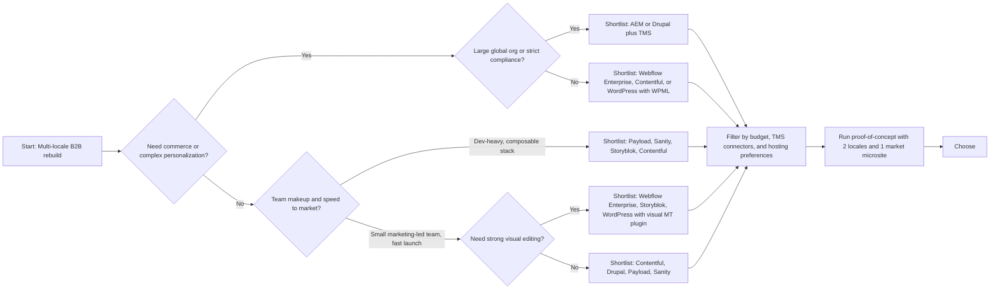

1) Key localization requirements (what your CMS must do for multi‑locale B2B in 2026)

- Translation workflows
  - Content flows: create/update in a “source” locale → route to translation (in‑house, agency, or MT) → in‑review per locale → publish. Drupal’s TMGMT module and AEM’s Translation Integration framework show what mature workflows look like: job creation, automatic content extraction, translator hand‑off, and return‑to‑CMS with review steps.【turn9find0】【turn9find4】
  - State visibility: “outdated translation” flags when the source changes. Drupal’s Content Translation + TMGMT supports this explicitly; AEM MSM + Translation can propagate source changes and trigger translation jobs.【turn9find0】【turn8fetch13】
  - Support for human, machine, and hybrid (post‑edit MT) flows. AEM’s translation connectors to third‑party TMS are a reference model for integration patterns.【turn9find4】

- Localized slugs and URL design
  - Per‑locale slugs (e.g., /en-us/solutions, /de-le/loesungen) and language‑prefix routing; Drupal and WordPress/Polylang/WPML both support this, with WPML explicitly listing localized URLs/slug management and SEO integration as core requirements.【turn9find0】【turn8fetch3】
  - Automated redirects when a slug changes (and the same for locale variants), plus URL‑change propagation to hreflang/sitemaps. Webflow notes that 301s must be set per locale if you’re using locale subdirectories.【turn8fetch0】

- hreflang
  - Correct, self‑referencing clusters with x‑default, using proper ISO codes. Google’s guidance is the baseline. Webflow auto‑generates hreflang in <head> and/or sitemaps; Polylang auto‑adds hreflang in WordPress; Drupal’s Simple XML Sitemap can include hreflang when configured.【turn8fetch6】【turn8fetch0】【turn8fetch5】【turn9find1】
  - Each locale’s canonicals must align and not cross‑purpose with hreflang. WPML’s SEO guide emphasizes coordinated canonical + hreflang management.【turn8fetch3】

- Localized SEO metadata
  - Per‑locale title, description, OG/Twitter tags, and alt texts. Webflow supports per‑locale SEO fields; Drupal’s Metatag module supports multilingual settings for titles, descriptions, and OG tags.【turn8fetch0】【turn9find0】
  - Separate robots/sitemap rules per locale (e.g., noindex draft locales). Webflow only includes published locale subdirectories in the sitemap by default.【turn8fetch0】

- Fallback content
  - Configurable fallback chains (e.g., de‑CH → de‑DE → en‑US) so pages never break. Contentful supports custom fallback trees per locale; Payload has a global fallback flag and per‑request control; Storyblok and Sanity rely on app‑layer logic or field‑level design to avoid empty values.【turn9find3】【turn10fetch1】
  - Clear UX signals when content is in a fallback language (e.g., badges) to maintain trust; Pantheon’s Drupal guide calls this out explicitly.【turn9find0】

- Regional permissions (governance/access)
  - Locale‑specific editing rights to avoid local editors overwriting the master locale. Webflow Enterprise supports locale‑specific access by role (Designer/Marketer/Editor/Custom roles) to restrict which locales a user can edit.【turn8fetch1】
  - Granular RBAC by content type/locale (not just language). Contentful’s custom roles and content permissions allow fine‑grained controls; AEM’s ACL model supports per‑branch permissions for regional sites.【turn8fetch11】【turn6search0】

- Country‑specific pages & microsites
  - Ability to compose shared modules (e.g., global product specs) with local overrides (regional proof points, case studies, pricing). AEM’s MSM + Live Copy models this explicitly: a blueprint rolls out to regional “Live Copies” with optional detach for local edits.【turn8fetch13】
  - Separate page trees or spaces per country when required. Storyblok supports space‑level translation for teams that need high autonomy per market; Contentful can model per‑region environments/spaces.【turn12find2】【turn8fetch11】

- Content duplication risks
  - Single source of truth: field‑level localization (Contentful, Payload) avoids duplicating entries per locale and keeps references intact across languages.【turn8fetch12】
  - MSM‑style inheritance instead of copy‑paste to prevent drift; AEM docs explicitly warn against manual duplication for multi‑site and recommend MSM for scalable reuse.【turn8fetch13】
  - Unique, canonical page per locale with hreflang to avoid “same language” duplicates; Google’s guidance emphasizes using hreflang (not canonicals) to relate language/region variants, and localizing truly country‑specific content within the same language (e.g., en‑US vs en‑GB).【turn8fetch6】

- Translation Management System (TMS) integrations
  - Native or partner connectors that push new/updated content, receive translations back, and preserve formatting. Smartling and Phrase publish direct connectors for AEM, Contentful, Drupal, WordPress, etc., which automate extraction and reimport without file gymnastics.【turn3search9】【turn3search11】【turn3search12】
  - Support for XLIFF/JSON round‑trips and glossary/TM leverage. Polylang Pro supports XLIFF export/import for WordPress; TMGMT in Drupal supports multiple TMS backends.【turn8fetch4】【turn9find0】

- Governance for global vs local marketing teams
  - Role‑based access, environments, and approval workflows to protect brand assets while allowing local copy edits. Contentful’s environments plus custom roles, and Webflow’s locale‑scoped access, are examples of tools that enable this balance.【turn8fetch11】【turn8fetch1】
  - Formal localization governance (RACI, style guides, terminology, review SLAs). Industry guidance stresses that without a governance model, localization becomes fragmented and costly; this is organizational, but the CMS should support it (workflows, audit logs, permissions).【turn3search4】

- Cost and maintenance implications of localization
  - CMS/licensing cost scales with locales, users, and features. Storyblok’s free tier includes only 2 locales; Contentful’s Lite plan is ~$300/month (locales included, but TMS integrations and enterprise IAM incur more); Sanity’s Growth plan is per‑seat with unlimited locales but paid add‑ons for SSO/dedicated support.【turn4search0】【turn4search7】【turn4search10】【turn4search11】
  - Hosting/infra cost grows with more locale variants (caching, CDN, build times for static sites), especially on traditional or hybrid platforms; Drupal hosts emphasize multilingual caching and CDN tuning for performance.【turn9find0】
  - Ongoing translation costs (per word, project minimums, and TM leverage) typically dwarf platform costs as locales grow; workflow automation via TMS connectors is the main lever to control this.【turn3search9】【turn3search6】

2) Common localization mistakes

- hreflang errors
  - Incorrect or inconsistent ISO codes, missing self‑reference, missing x‑default, or broken URLs—Google may ignore the whole cluster if any entry is wrong. Common anti‑patterns include not cross‑referencing URLs and bad domain mapping.【turn3search0】【turn3search3】
  - Mismatch between <head> hreflang and sitemap hreflang, or between page canonicals and hreflang targets. Webflow’s docs recommend using either page‑level hreflang or sitemap hreflang, not both with conflicting data, and keeping them in sync on publish.【turn8fetch0】

- Duplicating content instead of localizing
  - Publishing near‑identical pages in the same language with only minor changes (e.g., currency) and relying only on hreflang, without actual localization; Google’s guidance and SEO best‑practice articles stress localizing truly regional elements (vocab, currency, examples) when serving the same language to different countries.【turn8fetch6】【turn7search12】
  - Using canonicals to point country variants to a single page when you should be using hreflang, which confuses targeting signals.【turn2search13】

- Over‑reliance on raw machine translation
  - Publishing unedited MT at scale; search quality guidance notes that machine‑translated content often ranks poorly and can incur quality actions, especially when it’s obvious and unreviewed.【turn3search0】

- Ignoring fallbacks and empty fields
  - Allowing empty fields to render without fallback, leading to broken layouts or blank titles. Contentful’s docs show how to avoid this with custom fallback locales and by understanding when fallback triggers (no value set) vs when it doesn’t (null/empty set via API).【turn9find3】

- No localized slugs/metadata
  - Keeping identical slugs/meta across locales, which hurts CTR and indexing for non‑English markets. WPML calls out localized URLs, slugs, and meta titles/descriptions as core multilingual SEO requirements.【turn8fetch3】
  - Forgetting to localize OG/social previews and image alt text, which reduces social visibility and accessibility.【turn9find0】

- Weak governance and access control
  - Giving all markets edit rights to the primary locale, leading to drift. Webflow’s locale‑specific access feature exists precisely to mitigate this, and Contentful/AEM both emphasize role‑based permissions for distributed teams.【turn8fetch1】【turn8fetch11】
  - No global style guide or glossary, causing inconsistent terminology across markets; governance guidance stresses formalizing these to reduce rework and brand risk.【turn3search4】

- Platform‑specific “gotchas”
  - Using Webflow’s localization with Ecommerce enabled is not supported; you must choose one or the other, which has burned B2B commerce teams.【turn8fetch2】
  - On WordPress, mixing multiple i18n plugins or relying on free tiers that lack SEO features (sitemaps, hreflang, slug translation) creates maintenance headaches; comparisons note Polylang free lacks slug translation (Pro required), and WPML is often preferred for WooCommerce multilingual.【turn8fetch4】【turn8fetch15】

3) CMS category comparison

Summary first, then details.

- Categories used below
  - Traditional monolithic: WordPress, Drupal, AEM
  - Visual SaaS: Webflow
  - Headless/API‑first: Contentful, Sanity, Storyblok, Payload

High‑level capability snapshot (qualitative; “++” = strong OOTB, “+” = good with some setup, “‑” = limited/none)

| Requirement | WordPress | Webflow | Drupal | AEM | Contentful | Sanity | Storyblok | Payload |
|---|---|---|---|---|---|---|---|---|
| Translation workflows | + (via WPML/Polylang/TMS) | + (API & TMS; GUI is basic) | ++ (TMGMT + core) | ++ (Translation Integration) | ++ (via TMS connectors) | + (via TMS/DAOs) | + (TMS + AI assist) | + (via TMS/webhooks) |
| Localized slugs | + (WPML/Polylang) | + (Advanced/Enterprise plans) | ++ (Pathauto + i18n) | ++ (OOTB) | + (app‑layer; slug not localized by default) | + (app‑layer) | + (API/routing) | + (app‑layer) |
| hreflang | + (WPML/Polylang) | ++ (auto in <head>/sitemap) | ++ (sitemaps + Metatag) | ++ (OOTB) | + (app‑layer; docs & guides exist) | + (app‑layer) | + (app‑layer) | + (app‑layer) |
| Localized SEO metadata | + (with SEO plugins) | ++ (per‑locale page settings) | ++ (Metatag + config translation) | ++ (OOTB) | + (localize fields; render in app) | + (localize fields; render in app) | + (localize fields; render in app) | + (localize fields; render in app) |
| Fallback content | + (plugins vary) | + (secondary inherits primary) | + (core language fallback) | + (OOTB) | ++ (custom fallback trees per locale) | + (via schema/plugins) | + (via field design or app logic) | ++ (configurable fallback flag) |
| Regional permissions | ‑ (no per‑locale OOTB) | ++ (Enterprise locale‑specific access) | + (Domain Access + roles; more setup) | ++ (ACLs per site branch) | ++ (custom roles, content permissions) | + (datasets/roles) | + (space roles) | + (code‑based access control) |
| Country‑specific pages | + (page tree per locale) | + (locale variants + subdirs) | ++ (multisite + Domain Access) | ++ (MSM + Live Copy) | + (environments/spaces) | + (datasets/spaces) | ++ (space‑level translation) | + (multi‑tenant config) |
| Duplication risk controls | + (centralized entries via plugins) | + (inherit/override model) | ++ (field‑level + entity translation) | ++ (MSM inheritance) | ++ (field‑level; shared references) | ++ (field/document‑level models) | ++ (field/folder/space options) | ++ (field‑level; code‑controlled) |
| TMS integration ecosystem | ++ (many connectors) | + (API; fewer native connectors) | ++ (TMGMT ecosystem) | ++ (built‑in Translation Integration) | ++ (Phrase, Smartling, etc.) | + (Smartling connectors exist) | + (TMS partners; API/webhooks) | + (webhooks/API; build your own) |
| Governance (global vs local) | + (with plugins/process) | ++ (Enterprise roles + locale access) | + (roles + workflows) | ++ (full RBAC + workflows) | ++ (environments, roles, audit logs) | + (roles/datasets) | + (roles/spaces) | + (code‑based) |
| Cost & maintenance (mid‑market) | Low‑mod (host + plugins) | Mid‑high (plans + locales) | Mid‑high (hosting + dev) | High (license + infra) | Mid‑high (per‑seat/plan + TMS) | Low‑mid (per‑seat; unlimited locales) | Low‑mid (per‑seat + locale tiers) | Low‑mid (infra + dev) |

What the platforms actually do (with citations)

- WordPress
  - Multilingual is plugin‑driven. WPML/Polylang handle hreflang, localized slugs, internal link mapping, and SEO plugin integration; WPML’s SEO guide explicitly lists these as table stakes.【turn8fetch3】【turn8fetch4】【turn8fetch5】
  - 2026 comparison: WPML (~$39–199/year) for WooCommerce and full SEO control; Polylang (free/Pro) for budget‑conscious teams; Weglot/TranslatePress for easier visual/auto MT, with trade‑offs in control and cost.【turn8fetch15】
  - Pros: large ecosystem, lots of agencies, low entry cost. Cons: plugin dependency, performance at scale, no native locale‑scoped permissions.

- Webflow
  - Native Localization (2026) supports per‑locale SEO metadata, auto hreflang in <head> and sitemap, locale routing (302s), and locale‑specific access on Enterprise plans. It also supports localized slugs on Advanced+ plans.【turn8fetch0】【turn8fetch2】【turn0search8】
  - Trade‑offs: Ecommerce cannot be combined with Localization; locale‑specific access and advanced routing are Enterprise‑only; governance is good but costlier at scale; Webflow is not headless‑first for complex omnichannel, which can limit B2B integrations.【turn8fetch2】【turn8fetch1】

- Drupal
  - Core multilingual stack (Language, Content Translation, Configuration Translation) plus TMGMT for workflow orchestration; field‑level translation and language negotiation by URL are baked in.【turn9find0】【turn0search12】
  - Strong multilingual SEO: Metatag module for per‑locale title/description/OG; Pathauto + Redirect for localized URL management; Simple XML Sitemap with hreflang support.【turn9find0】【turn9find1】
  - Regional access can be handled via Domain Access or role‑based permissions, though this is more “DIY” than AEM’s enterprise ACLs.【turn6search7】
  - Pros: robust, scalable, deep TMS ecosystem. Cons: higher dev/ops cost and steeper learning curve.

- AEM (Adobe Experience Manager)
  - MSM + Translation Integration: create a primary site, translate it, then roll out country variants via Live Copies, optionally detaching for local changes. AEM’s translation framework connects to external TMS for automated translation projects.【turn8fetch13】【turn9find4】
  - Enterprise‑grade permissions and multi‑site governance; supports fine‑grained ACLs per branch and environment. Translation connectors and best‑practice guides exist for both Sites and Headless use cases.【turn6search0】【turn9find4】
  - Pros: most complete OOTB for large, regulated B2B orgs. Cons: high license/infra cost and implementation complexity.

- Contentful
  - Field‑level localization: one entry per piece of content, with per‑field locale toggles and custom fallback chains (e.g., de‑CH → de‑DE → en‑US). Fallback only triggers when no value is set, not for null/empty set via API.【turn8fetch12】【turn9find3】
  - Locales are environment‑level; TMS integrations (Phrase, Smartling) are mature and widely documented.【turn8fetch10】【turn3search11】【turn3search12】
  - Pros: excellent for composable frontends and omnichannel reuse; strong governance via custom roles/content permissions. Cons: you must build routing, hreflang, and SEO rendering in your app layer, and pricing scales up quickly for large teams.【turn4search7】【turn4search6】

- Sanity
  - i18n is flexible: document‑level or field‑level via plugins (document‑internationalization, internationalized‑array). No rigid OOTB “locales” model; you choose the schema pattern that fits your workflow.【turn1search5】【turn1search7】
  - TMS connectors exist (e.g., Smartling Fields/Documents), but integrations are more DIY than AEM/Contentful.【turn1search8】
  - Pros: schema flexibility, strong developer experience, per‑seat pricing with unlimited locales. Cons: more engineering required for fallback logic, routing, and SEO plumbing; governance tooling is lighter than AEM/Contentful.【turn4search10】【turn4search11】

- Storyblok
  - Three strategies: field‑level, folder‑level (different structures per locale), and space‑level (separate spaces per market for autonomy). Space‑level translation is designed for large, multi‑team regional setups; CLI and Management API help share schemas/assets across spaces.【turn12find1】【turn12find2】
  - Pricing: free tier includes 2 locales; additional locales and enterprise governance scale with plan.【turn4search0】
  - Pros: visual editor, flexible i18n models, approachable pricing. Cons: fewer native TMS connectors than AEM/Contentful; heavier locales count requires higher tiers.

- Payload CMS
  - Built‑in localization config: declare locales, set defaultLocale, and enable fallback (true by default) to show the fallback locale’s value when a field has no localized value.【turn10fetch1】
  - Self‑hosted, TypeScript‑first; you own the infra. Integration with TMS is via webhooks/API (build your own connector), and routing/fallback/SEO are app‑layer responsibilities.【turn4search17】
  - Pros: low licensing cost, high control, strong Next.js integration. Cons: requires dev capacity for i18n tooling, and you must maintain infra and security.

4) Decision framework for mid‑market B2B companies

Use this flow to narrow options quickly.

Key decision axes to score each option

- Operating model
  - Marketing‑led (wants visual editing, quick campaigns): favor Webflow, Storyblok, WordPress.
  - Engineering‑led (composable frontends, multi‑channel): favor Contentful, Sanity, Payload, Drupal (headless).

- Scale and complexity
  - Many locales (>6), many country pages, strict brand/legal review: AEM or Drupal + TMGMT + TMS; Contentful is also viable if you can build the workflow tooling.
  - 2–4 locales, moderate content volume: most options work; prioritize TMS integration and governance fit.

- Localization depth
  - Heavy transcreation and in‑country review cycles: AEM, Drupal, Contentful (strong TMS ecosystems).
  - Mostly MT + light human review: Webflow, WordPress/WPML+MT, Storyblok (AI‑assisted translation options).

- Budget and timeline
  - Low initial budget but dev capacity: Payload or Sanity (self‑hosted or low per‑seat cost).
  - Higher budget, need managed SaaS with strong support: Contentful, Storyblok, Webflow Enterprise, AEM.
  - Very high budget, enterprise governance/compliance: AEM, Drupal (with Acquia/agency support).

5) Recommendations for companies planning multi‑locale rebuilds

- Start from requirements, not platforms
  - Lock down: target locales, URL structure (subdirectory vs subdomain vs ccTLD), TMS/provider, and who approves what (global vs local). Use Google’s hreflang guidance to validate URL/targeting decisions early.【turn8fetch6】

- Design your content model for localization from day one
  - Prefer field‑level localization (Contentful, Payload) or field‑level within a document (Storyblok field‑level, Sanity internationalized‑array) to avoid duplicating entries and breaking references.【turn8fetch12】【turn12find1】
  - Keep non‑translatable fields (dates, slugs, author references) shared, and only localize user‑facing text and SEO fields; Contentful’s practical guide explicitly recommends this pattern.【turn8fetch12】

- Make hreflang, localized slugs, and SEO metadata non‑negotiable features
  - Ensure your CMS or plugin handles: auto hreflang generation/updating, per‑locale slugs, and per‑locale meta/OG titles/descriptions. WPML’s SEO checklist is a good reference list to port to any platform.【turn8fetch3】
  - Validate with tools/linting in CI (hreflang spot‑checks, localized meta presence) and monitor Google Search Console for locale indexing issues.

- Choose a TMS and integration pattern early
  - For enterprise: TMS with direct connectors (Smartling/Phrase) to your CMS will dramatically reduce manual export/import; Smartling lists AEM, Contentful, Drupal, WordPress among supported platforms.【turn3search9】【turn3search12】
  - For mid‑market: even webhook/API integration to a TMS pays off quickly as locale count grows; XLIFF support (e.g., Polylang Pro) is a minimum viable pattern.【turn8fetch4】

- Build governance into the platform
  - Use environments for staging translations and content; locale‑scoped roles to protect the master locale. Webflow and Contentful both provide concrete tooling for this; AEM/Drupal provide the deepest RBAC.【turn8fetch1】【turn8fetch11】
  - Define a simple RACI for translation updates (who creates, who translates, who approves, who publishes), and mirror it in CMS permissions and workflow states.

- Prototype with 2–3 locales and one country microsite
  - Validate: fallback behavior, hreflang correctness, localized SEO rendering, and TMS round‑trip before scaling to 10+ locales. Payload’s docs and Storyblok tutorials both demonstrate small multi‑locale setups; the same principle applies to any CMS.【turn10fetch1】【turn12find1】

- Plan for cost and maintenance
  - Budget for: CMS licenses/seat costs, TMS per‑word costs with TM leverage, and infra scaling (CDN, caching). Storyblok and Sanity pricing pages show how locales can gate features or add costs; Webflow’s localization is an add‑on beyond Site plans.【turn4search0】【turn4search10】【turn8fetch2】
  - Measure: translation cycle time, percent of outdated translations, and locale‑specific SEO performance (rankings, CTR) post‑launch; use these to decide when to add locales or invest in automation.