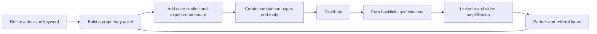

Here’s a playbook for how independent consultants and small specialist agencies can own high‑value B2B decision phrases like “CMS selection,” “website redesign,” “CMS migration,” and “website audit.”

I’ll keep it concrete and tie each tactic to real examples where possible.

---

## 1) Authority‑building tactics (and how they fit together)

This is the core loop: create a proprietary asset, then distribute it in ways that earn backlinks, citations, and trust signals.

Below are the specific levers, with mini‑examples.

### Original reports (surveys, benchmarks, “state of” studies)

What it is
- A first‑party data asset (often gated) that answers questions like “How are peers approaching website redesign budgeting and governance?” or “Which migration risks actually cause traffic loss?”
- Can include: survey findings, cost ranges, timelines, and decision criteria drawn from real projects.

Why it works
- Original data is one of the most link‑attractive content types because journalists and bloggers use it to back up claims with facts. Backlinko’s guidance on original research emphasizes this link‑building advantage. 【turn7search4】
- Data‑driven content correlates with higher engagement and better rankings; in a 2026 benchmark, high‑performing B2B SaaS teams said proprietary research improved rankings and organic traffic. 【turn7search12】
- It directly supports Google’s E‑E‑A-T emphasis on expertise, authority, and trust—especially for “your money or your life” (YMYL) decisions like platform selection. 【turn7search15】【turn7search16】

Small‑firm examples
- Pagepro’s “Best CMS Migration Providers (2026)” comparison includes concrete price ranges and a selection framework based on 150+ migrations, and it’s structured around SEO preservation and cost—this is the kind of data‑rich guide that earns citations. 【turn8fetch1】
- FocusReactive’s headless migration guide cites real cost ranges (e.g., ~$10k small site to $30k–$80k+ enterprise) and documents SEO risks such as 30–60% traffic drops; combining lived project data with market stats builds authority. 【turn8fetch0】

How to do it small
- Run a micro‑survey (10–15 questions) to 50–100 past clients and peers. Ask about: timeline, budget overrun, decision criteria, biggest pain, post‑launch outcomes.
- Add simple charts (bar/heatmap) and a short narrative. Gate the PDF (or ungated with clear email opt‑in).
- Reuse data: pull 2–3 “data snacks” (stats/charts) for LinkedIn posts and guest articles to drive downloads.

### Proprietary frameworks (named, repeatable methods)

What it is
- A named methodology or checklist your firm uses internally, published openly (or partially). This shows you have a system, not just ad‑hoc opinions.

Why it works
- E‑E‑A‑T rewards “demonstrated expertise” and first‑hand experience; a named framework is a clear signal. 【turn7search16】
- It gives prospects a mental shortcut: “They have a process I can trust.”

Small‑firm examples
- WebLogic (Ireland) publishes an 8‑step “Website Redesign Strategy” framework that explicitly ties design decisions to business outcomes, SEO, and performance—framed as “the strategic framework we use with every client.” That positioning differentiates them from agencies that lead with visual design. 【turn6fetch0】
- Storify Agency’s “CEO Website Audit: 10 Questions That Reveal Authority” is an executive‑focused diagnostic framework built around narrative and positioning, not just metrics. It’s specifically designed for CEOs evaluating whether their site builds authority. 【turn6fetch1】

How to do it small
- Take what you already do on projects and write it as a 5–10 step framework (with “why” and “red flags”).
- Give it a name: “Our 6‑Gate CMS Migration Playbook,” “Website Redesign Readiness Score,” etc.
- Publish as an ungated article and as a 1–2 page PDF checklist for download.

### Survey/data assets (micro‑data you can produce cheaply)

What it is
- Small, reusable datasets that fuel your reports and LinkedIn posts: e.g., average time to launch, common failure modes, audit finding frequencies.

Why it works
- Numbers make arguments credible. Citing “our analysis of 40 website audits” or “50+ migration projects” is more convincing than generic advice.

How to do it small
- Extract patterns from your past projects (anonymized) and internal tools.
- Present as: “In 40 website audits, these 7 issues appeared in 80%+ of cases” or “Migration timeline vs. budget overruns across 25 projects.”

### Interactive tools (calculators, estimators, graders)

What it is
- A web tool that delivers personalized output: ROI estimator, CMS shortlister, migration risk checker, audit grader.

Why it works
- Free tools and original research consistently attract the most backlinks because they’re useful and “cite‑worthy.” 【turn7search14】
- Tools create direct engagement and naturally lead to calls if you add a “Book a debrief” CTA.

Small‑firm examples
- Four Eyes (Charlotte, NC) built a Website Redesign Cost vs. Benefit Estimator that walks SMBs through ROI math, tying redesign spend to projected leads/revenue and warning about hidden risks like SEO migration mistakes. 【turn3fetch1】
- My Web Audit offers an AI‑powered website audit tool for agencies, with a sample “AI Visibility Audit” walkthrough that shows how to present findings and close deals. 【turn5search13】【turn4search18】

How to do it small
- Start with spreadsheets turned into simple web apps (e.g., Google Apps Script, Softr, or a lightweight React widget). Focus on one calculator:
  - Website Redesign ROI (cost vs. projected lead uplift).
  - CMS Migration Cost Estimator (complexity sliders → budget range).
  - Website Audit Scorecard (input 10–15 checks → a grade + report).

### Case studies (results‑first narratives)

What it is
- Client stories structured around the decision, the method, and the measurable outcome.

Why it works
- E‑E‑A‑T places heavy weight on evidence of real‑world results and first‑hand experience. 【turn7search16】

How to do it small
- Follow a tight structure:
  1) Situation & business goal
  2) The decision (which CMS; why migrate; why redesign now)
  3) Method (your framework)
  4) Results (traffic, conversion rate, leads, time/cost)
  5) Lessons
- Include artifacts (anonymized): decision matrices, migration checklists, before/after metrics.

### Expert commentary (newsjacking, trend analysis, contrarian takes)

What it is
- Timely commentary on platform changes, algorithm updates, or vendor news tied to your keywords.

Why it works
- Positions you as a go‑to source for “what this means for your CMS/website” decisions.
- Often picked up by industry roundups and LinkedIn curators.

How to do it small
- Monitor vendor blogs (WordPress, Webflow, Contentful, Sanity, HubSpot, etc.), Google Search Central, and mainstream tech press.
- Within 24–48 hours, publish a short, opinionated post: “What [vendor change] means for your 2027 CMS migration.”

### Backlinks & citations (the SEO flywheel)

What it is
- Earning inbound links and references from reputable domains.

Why it works
- Backlinks remain a strong signal of trust and authority in rankings; top results tend to have significantly more backlinks than lower positions. 【turn7search2】
- Original research, tools, and unique frameworks are among the most linked content types. 【turn7search4】【turn7search14】

How to do it small
- Target “resource lists,” “best X for Y,” and vendor ecosystem blogs with:
  - Data quotes from your report (“our study of 40 migrations found X”).
  - Guest posts that reference your framework and link back.
- Offer embeddable charts (with a “Source: Your Firm” badge).

### LinkedIn thought leadership

What it is
- Consistent posting that repurposes your deeper assets into short, opinionated, data‑backed pieces.

Small‑firm examples
- Nova Era Agency (843 followers) used LinkedIn to promote a “Website Redesign RFP Guide + Template (2026),” describing exactly what the resource covers and why a well‑prepared RFP improves outcomes—this is a strong, practical LinkedIn thought‑leadership post that ties directly to a decision keyword. 【turn9fetch1】

How to do it small
- 2–3 posts/week per decision keyword:
  - One “data snack” from your report (chart + 3‑line insight).
  - One contrarian hot take or lesson.
  - One “how to” tied to your framework.
- Add a clear CTA: “DM me ‘AUDIT’ or ‘CMS’ for the full report.”

### YouTube/video as trust proof

What it is
- Screen‑share walkthroughs, case study explainers, or short opinion pieces that show your process.

Small‑firm examples
- Josh Hall’s website audit walkthrough (22k+ views) shows a live audit and explicitly frames it as a template viewers can use to sell their own audits. 【turn2search10】
- Tristan Parker’s “How We Audit a Website to Add Value” (22k+ views) walks through an agency’s audit approach, demonstrating expertise visually. 【turn2search12】
- Exposure Ninja’s “5 Signs It’s Time To Redesign Your Website” positions the agency as an educator on redesign decisions. 【turn2search1】

How to do it small
- 10–15 minute videos:
  - “Live website audit teardown” ( anonymized prospect site).
  - “How we’d migrate [Platform A] → [Platform B] for this business.”
- Embed these on your service/audit pages and in case studies; link from LinkedIn posts.

### Partner/referral content

What it is
- Co‑branded or easily syndicatable assets for系统集成商, CRM/agency partners, and tech vendors.

Why it works
- Leverages other people’s audiences (and domains) to extend reach and earn links.

How to do it small
- Create “white‑label” versions of your audit checklist or CMS selection scorecard partners can brand.
- Offer to co‑host a webinar on “How to choose a CMS for multi‑language B2B sites” with a translation/tech partner; cross‑promote and co‑author a post.

### Comparison pages (X vs Y guides and “best for” tables)

What it is
- SEO‑focused pages that compare 2–3 options along decision‑relevant criteria, or rank providers by use case.

Why it works
- Comparison pages are high‑intent and often rank for “[A] vs [B]” queries; they work for both SEO and conversion when done honestly. 【turn7search5】【turn7search8】

Small‑firm examples
- Neighbourhood (NBH) built “HubSpot CMS vs WordPress: The Ultimate Comparison,” breaking down differences across eight key areas and adding an AI‑generated audio version to increase accessibility and engagement. 【turn3fetch2】【turn9fetch2】
- Moore‑Wilson published “Drupal or Craft CMS – a comparison,” laying out strengths/weaknesses and use‑case guidance to help mid‑ to enterprise‑level sites choose. 【turn3fetch3】
- Digital Applied’s “CMS Comparison Matrix 2026: 20+ Platforms Compared” uses an eight‑dimension evaluation (content editing, DX, performance, extensibility, pricing/TCO, migration ease, eCommerce, AI/agentic) and a decision framework by use case—exactly the kind of proprietary, opinionated decision tool that earns citations. 【turn3fetch0】

How to do it small
- Start with 2–3 comparisons that match your expertise:
  - WordPress vs Webflow for B2B lead gen.
  - Contentful vs Sanity for multi‑brand sites.
  - HubSpot CMS vs WordPress.
- Structure each page: summary, criteria, recommendation by scenario, and tie‑ins to your services (“Not sure? We’ll run a 30‑min decision workshop.”)

---

## 2) Examples from small agencies or consultants

Here are concrete patterns you can emulate (not copy):

- Named frameworks published openly
  - WebLogic: 8‑step “Website Redesign Strategy” framework tied to business outcomes, content‑first, and performance. 【turn6fetch0】
  - Storify Agency: “CEO Website Audit: 10 Questions That Reveal Authority,” an executive diagnostic framework. 【turn6fetch1】

- Comparison pages that signal deep experience
  - Neighbourhood: HubSpot vs WordPress comparison across eight dimensions; includes audio to increase consumption. 【turn3fetch2】【turn9fetch2】
  - Moore‑Wilson: Drupal vs Craft, with strengths/weaknesses and real brand examples. 【turn3fetch3】
  - Digital Applied: CMS Comparison Matrix 2026 with 8 evaluation dimensions and a use‑case decision framework. 【turn3fetch0】

- Interactive tools/case‑style guides
  - Four Eyes: Website Redesign Cost vs. Benefit Estimator for SMBs, with explicit ROI framing and risk warnings. 【turn3fetch1】
  - Pagepro: “Best CMS Migration Providers (2026)”—a transparent comparison table with starting prices and SEO expertise ratings. 【turn8fetch1】
  - FocusReactive: Headless CMS migration guide with realistic cost ranges and SEO risk documentation. 【turn8fetch0】

- LinkedIn distribution of downloadable assets
  - Nova Era Agency: LinkedIn post promoting a 2026 Website Redesign RFP Guide + Template, with a clear description of what’s inside and why it matters. 【turn9fetch1】

- Video as trust proof
  - Josh Hall: Live website audit teardown showing how to structure and price audits. 【turn2search10】
  - Tristan Parker: “How We Audit a Website to Add Value,” an agency walkthrough. 【turn2search12】

---

## 3) How original reports support SEO authority

Direct SEO benefits
- More high‑quality backlinks: original research and free tools are among the most linked content types, which directly supports rankings. 【turn7search4】【turn7search14】【turn7search2】
- Stronger E‑E‑A‑T signals: Google’s quality guidance emphasizes trust and first‑hand experience; data you collected yourself (surveys, project logs) is hard to fake and reinforces “experience” and “expertise.” 【turn7search15】【turn7search16】
- Higher engagement and dwell time: in‑depth reports with charts and case narratives increase time on page, supporting “helpful content” signals. 【turn7search15】

Indirect benefits
- Thought‑leadership loops: reports give you months of derivative content (LinkedIn posts, guest articles, webinars, video breakdowns), increasing brand search volume and branded anchors.
- Conversion asset: gating the report captures emails; follow‑up nurture sequences improve conversion rates, which can indirectly influence engagement signals.

Practical tips for maximum SEO value
- Make the landing page indexable and rich:
  - Unique title/H1 focused on the keyword (“CMS Migration Decisions: 2026 Benchmark Report”).
  - Structured data (Article/Report).
  - A short, quotable executive summary above the fold.
- Include “cite this report” guidance (suggested HTML snippet with title, author, URL).
- Offer data snippets/charts for republishing with a mandatory link back.

---

## 4) How to distribute a CMS decision report

Goal: get the report in front of decision‑makers and earn citations.

Step‑by‑step distribution plan

1) Own‑site hub
- Create a dedicated landing page:
  - Clear title (e.g., “2026 CMS Migration Decisions: Benchmarks & Checklists”).
  - 3–5 key stats in a visual banner.
  - Email gate (or partial ungating: intro + TOC visible, full PDF behind form).
- Internal links:
  - From your CMS selection, website redesign, and migration service pages.
  - From blog posts that reference the report’s data.

2) LinkedIn launch (personal + company)
- Founder/lead consultant posts:
  - Short hook (“We analyzed 40 CMS migrations. Here’s what actually causes traffic loss…”).
  - 1–2 charts.
  - CTA to DM for the PDF.
- Company page:
  - Link post with a short summary and a clear “Download” CTA; use relevant hashtags (#CMS #WebsiteRedesign #DXP).

3) Email nurture
- Existing list: segmented email featuring 2–3 top findings and a CTA to download.
- For leads who downloaded the report:
  - 5–7 email sequence: 1) key findings; 2) common mistakes; 3) short case; 4) how we use the framework; 5) invitation to a 30‑min workshop.

4) Partner and referral amplification
- Identify:
  - Implementation partners (e.g., CRM agencies, MarTech consultants).
  - Non‑competing agencies with complementary services (SEO, branding).
- Offer:
  - Co‑branded one‑pager.
  - Early access to data.
- Ask them to:
  - Share with their clients.
  - Link to the report from their own resource pages.

5) Earned media and guest posts
- Pitch 2–3 data‑driven angles to industry blogs and trade press:
  - “X% of CMS migrations miss these SEO steps.”
  - “Why most website redesigns fail to hit ROI targets.”
  - Include an embeddable chart; require source link.

6) Community channels
- Slack/Discord groups for developers and CMS implementers (Contentful, Sanity, WordPress, Webflow, etc.).
- LinkedIn Groups and niche communities (e.g., UX, B2B marketing, web performance).
- Share a data snippet and a link; don’t spam.

7) Repurposing flywheel
- Turn key chapters into:
  - 2–3 blog posts (each targeting a variant keyword: “CMS migration checklist,” “website redesign ROI,” etc.).
  - 5–10 LinkedIn posts.
  - 1–2 videos or webinars.
- Always link back to the report landing page to consolidate authority.

---

## 5) Practical 90‑day authority plan (for a solo consultant or micro‑agency)

Focus: pick one decision keyword to own first (e.g., “CMS migration” or “website redesign”).

### Days 1–30: Foundation + one flagship asset

- Define your keyword cluster
  - Example cluster around CMS migration:
    - CMS migration guide, checklist, cost, SEO risks, headless migration, DXP migration.
  - Ensure you have a service/landing page for each core term.

- Build one flagship asset (choose one to start)
  - Option A: “CMS Migration Benchmarks & Mistakes” short report (based on your projects + partner input).
  - Option B: “Website Redesign Readiness Framework” (8–10 step checklist with scoring).
  - Option C: A simple interactive tool (e.g., “Redesign ROI estimator” or “CMS shortlister”).

- Publish the asset
  - SEO‑optimized landing page (title, meta, schema).
  - Internal links from related service/blog pages.
  - Basic email gate (name + company + role) to capture leads.

- Begin LinkedIn cadence (2–3 posts/week)
  - Share one data point or framework step per post.
  - Hook format: “In our last X migrations, we saw Y. Here’s how to avoid it.”
  - CTA: “DM me ‘MIGRATION’ for the full guide.”

### Days 31–60: Distribution + comparisons + case studies

- Create 2–3 comparison pages
  - Example: “WordPress vs Webflow for B2B”; “Contentful vs Sanity for multi‑brand.”
  - Structure: summary → criteria → “best if” → tie‑in to your workshop/audit.

- Add 1–2 case studies
  - Use the “Situation → Method → Outcome” template.
  - Include a mini‑chart showing before/after metrics.
  - Embed short video (2–5 minutes) explaining the decision.

- Run a small survey (if you haven’t already)
  - 8–12 questions to your client list and a few peer partners.
  - Analyze and add 3–5 new data points to the report; issue a “Q3 update” to re‑engage earlier downloaders and invite new ones.

- Expand LinkedIn and start outreach
  - Repurpose case studies and comparison highlights into LinkedIn posts.
  - Begin 10–15 targeted outreach emails to partners and industry blogs offering an exclusive data angle or guest post tied to your report.

### Days 61–90: Tools, video, and partner loops

- Ship a lightweight interactive tool
  - Example: a “Redesign ROI calculator” (Four Eyes’ model is a good pattern) or a “CMS Migration Risk Checker.” 【turn3fetch1】
  - Add to your website with clear CTAs (“Get a custom debrief”).

- Publish 2–3 videos
  - 10–15 minutes each:
    - Live audit teardown.
    - Migration walkthrough.
    - Framework explainer.
  - Embed in relevant blog/comparison pages and share on LinkedIn.

- Formalize partner/referral content
  - Co‑host a webinar or co‑author a piece with a complementary partner (CRM/UX/SEO).
  - Provide a “partner kit”: summary one‑pager, sample social copy, and embeddable chart.

- Consolidate SEO
  - Ensure all assets (report, framework, tools, case studies, comparisons) are interlinked.
  - Add schema (Article/HowTo/FAQ) where appropriate.
  - Review analytics: identify which pages are driving conversions and double down on those keywords in month 4.

---

If you share your target geography and the specific keyword you want to rank for first (e.g., “CMS migration” vs “website redesign”), I can tailor a 90‑day plan with page titles, internal linking structure, and a concrete survey/script you can send to clients this week.