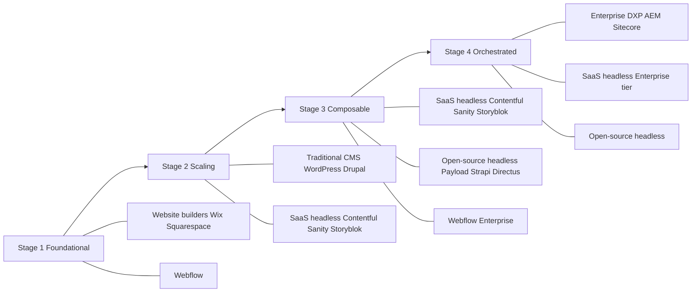

1) CMS category overview

- Website builders (Wix, Squarespace)
What they are: All-in-one, template-driven site builders with integrated hosting, basic CMS, and built‑in marketing tools. Designed for speed-to-launch.

Best-fit use cases: Early-stage B2B “brochure” sites, small service firms, simple lead-gen pages, event microsites. Good when the site is a small part of GTM and integrations are light. Squarespace leans a bit more into portfolio/brand aesthetics and commerce; Wix leans into breadth of apps and business features.

Typical buyer/company profile: <25-person companies; marketing-led (no or small dev team); limited technical resources; one primary site. Mid-market usually only uses these for satellite brands, microsites, or pilots, not the main corporate web property.

Strengths
- Very fast time to value: pick a template, customize, launch.
- Hosting, security basics, and core marketing tools (forms, email, basic SEO, analytics) are included.
- Low or no coding required; non-technical marketers can build and update pages.
- Wix’s app ecosystem and built-in marketing suite; Squarespace’s design polish and commerce flows.

Weaknesses
- Limited front-end and backend customization. Template constraints shape UX/brand expression.
- SEO and performance are “good enough,” but you don’t control the stack. Advanced schema, edge logic, or A/B infrastructure are constrained.
- Vendor lock-in to the builder’s hosting and features; export options are limited (content can usually be exported, but not a full theme+logic port). Squarespace has no built-in i18n—multilingual needs third-party integrations like Weglot【turn4search13】【turn4search17】.
- At mid-market scale you hit functional limits around personalization, complex workflows, and multi-site governance.

Cost model
- Per-site SaaS subscription by tier (monthly/annual). Tiers unlock storage, commerce, custom domains, remove builder branding, etc. Wix and Squarespace publish clear tiered pricing【turn0search5】【turn1search1】.
- Add-on costs can accumulate: premium apps, third-party multilingual tools, higher transaction fees on commerce tiers.

Implementation complexity
- Low. Hours/days for a single site; largely DIY. Mid-market may use an agency for design polish, but not deep engineering.

Marketing autonomy
- High. Marketers can create and publish pages, change copy, swap images, and manage basic forms without developer help.

Developer control
- Low to moderate. Wix offers Velo (JS) for custom behavior; Webflow (below) offers more control. In both, you can’t fully own the hosting stack.

Localization support
- Wix: reasonably strong via Wix Multilingual (an app that supports manual/auto translation to 180+ languages with per-language SEO settings)【turn6search3】【turn6search6】.
- Squarespace: no robust built-in i18n; multi-language typically relies on a third-party integration like Weglot【turn4search13】【turn4search17】.

Multi-brand support
- Weak. Each site is a separate project; there’s no native shared content hub or cross-brand governance. Manageable for one or two sites, not for many.

Security/governance
- Good for a managed SaaS (Wix maintains SOC 2 Type 2, PCI DSS L1, ISO, GDPR/CCPA/LGPD compliance at the platform level)【turn3search10】【turn3search12】.
- Governance is coarse-grained: limited roles; limited approval workflows; audit logging is minimal compared with enterprise DXP or headless.

Migration risk
- Low technical risk to start, but moderate-to-high strategic lock-in. Exporting content is possible, but design/logic and integrated features (forms, automations) typically don’t port cleanly to another CMS.

- Visual builders (Webflow)
What it is: A design-led, visual canvas that generates clean front-end code (HTML/CSS/JS) and couples it with an integrated CMS and hosting. Bridges design and development.

Best-fit use cases: Mid-market brand sites, marketing hubs, and microsites where design fidelity and performance matter, but teams don’t want a fully custom codebase. Also used for design systems prototyping.

Typical buyer/company profile: 20–200-person B2B companies with in-house or agency designers; often a small front-end dev or engineer available for integrations. Marketing wants autonomy, but engineering cares about semantic output and extensibility.

Strengths
- Design control and clean code output (industry-standard HTML/CSS/JS) compared with template builders.
- Strong CMS with structured content types, relationships, and dynamic pages.
- Enterprise plan unlocks SSO/SOC 2 Type II, advanced permissions, SLAs, and native localization workflows【turn1search6】【turn1search8】.
- Reusable components and symbols enable design-system-like consistency.

Weaknesses
- Still a closed SaaS for hosting and runtime; you don’t own the delivery infra.
- Complex, high-traffic, or highly personalized architectures (multi-region edge logic, complex personalization) are limited vs headless/DXP.
- Localization is strong at the page level but CMS-item translation at scale is manual and can become a bottleneck【turn6search9】.

Cost model
- Per-site plans by tier; Enterprise is custom and typically higher (adds SOC 2, SSO, SLA)【turn1search5】【turn1search6】. Mid-market B2B often ends up on Premium or Team tiers; Enterprise for regulated/governed use cases.

Implementation complexity
- Moderate. Design/prototyping is fast; front-end dev may still be needed for complex interactions and backend integrations.

Marketing autonomy
- High for page builds, copy, and layout changes within the visual canvas. Minor custom code is possible, but larger integrations usually need dev support.

Developer control
- Moderate to high for front-end (can export code). Backend logic is constrained; for deeper APIs or composable stacks, teams often integrate a headless CMS via Webflow’s APIs.

Localization support
- Native localization now ships with locale-based routing, per-locale page variants, and region-based routing—fully native on Enterprise, with some capabilities on lower plans【turn4search8】【turn1search6】.

Multi-brand support
- Limited. Each site is separate; some agencies use workspaces or cloned templates, but there’s no shared content hub or cross-brand governance.

Security/governance
- Enterprise adds governance: SSO, SOC 2 Type II, advanced user roles, and SLAs【turn1search6】【turn1search8】. Lower tiers are less suited for regulated industries.

Migration risk
- Moderate. You can export code and CMS content, but design system and interactions are tightly coupled to Webflow’s canvas; porting to another platform often requires a front-end reimplementation.

- Traditional CMS (WordPress, Drupal)
What they are: Monolithic CMS where backend and front-end are tightly coupled. WordPress is ubiquitous (≈42–59% of all websites use it)【turn7search1】; Drupal is powerful for complex, multi-site, governance-heavy deployments.

Best-fit use cases
- WordPress: Corporate sites, blogs, resource centers, simple lead-gen sites. Good fit when you want a large ecosystem of plugins and agencies and can enforce governance via hosting (e.g., WordPress VIP) and careful plugin choices.
- Drupal: Complex multi-site ecosystems, regulated industries, granular permissions, structured data, and heavy integrations. Common in higher-ed, government, and large B2B with many regional sites【turn3search6】.

Typical buyer/company profile
- WordPress: broad mid-market, including non-technical marketing teams with dev/agency support. Often the default due to ecosystem size.
- Drupal: Mid-market to enterprise with strong dev teams or Drupal agencies; frequently used in orgs with 5+ regional/brand sites and strict governance.

Strengths
- WordPress: huge plugin/theme ecosystem; large talent pool; fast prototyping; WordPress VIP adds hardened security, autoscaling, and FedRAMP authorization【turn3search0】【turn3search1】.
- Drupal: robust multi-site from one codebase【turn3search7】; granular roles/permissions; strong security track record with a dedicated security team and regular advisories【turn5search15】; deep customization.

Weaknesses
- WordPress: security and performance are highly dependent on hosting and plugin choices; plugin bloat and version conflicts are common governance risks; multisite improves ops but can increase blast radius if a shared plugin is compromised【turn3search4】.
- Drupal: steep learning curve; higher TCO for implementation/maintenance; smaller talent pool than WordPress.

Cost model
- Software: free/open-source. Costs come from hosting, plugins, themes, agency/dev retainer, and enterprise tiers (WordPress VIP, enterprise Drupal support).
- WordPress VIP and managed Drupal hosts typically price via custom contracts (often usage/traffic + support tiers).

Implementation complexity
- WordPress: low-to-moderate for small sites; moderate-to-high at scale with custom themes, headless front-ends, or VIP governance.
- Drupal: high; requires experienced developers or agencies.

Marketing autonomy
- WordPress: high with page builders and Gutenberg; governance must be enforced via hosting/tools.
- Drupal: moderate to low without heavy configuration; editing can be complex for non-technical users.

Developer control
- High. Both are open-source and highly extensible; Drupal especially supports deep customization and complex data models.

Localization support
- Both support multilingual via core and plugins; WordPress VIP documents robust multilingual setups and geolocation【turn3search2】. Drupal has strong i18n core capabilities used by global organizations.

Multi-brand support
- Both support multi-site architectures from a single codebase (WordPress Multisite; Drupal multi-site), but configuration complexity and governance overhead grow with the number of sites/brands【turn3search4】【turn3search7】.

Security/governance
- WordPress: strong when paired with enterprise hosting and disciplined processes; otherwise risk is higher due to plugin ecosystem. WordPress VIP adds multiple security layers and FedRAMP【turn3search0】.
- Drupal: strong security ethos, frequent core advisories, and mature access-control features【turn5search15】.

Migration risk
- Moderate to high when leaving due to deep customization and plugin dependencies. Migrating from WordPress to headless often means rebuilding templates and reorganizing content models.

- Enterprise DXP (AEM, Sitecore)
What they are: Full-suite digital experience platforms combining CMS, DAM, personalization, CDP/marketing automation, and sometimes commerce. Delivered via SaaS/cloud with continuous updates (e.g., AEM as a Cloud Service)【turn5search4】.

Best-fit use cases: Global B2B brands with multiple sites/brands, heavy personalization needs, multi-channel campaigns, and mature marketing ops. Common in manufacturing, life sciences, financial services.

Typical buyer/company profile: Upper mid-market to enterprise (often $100M+ revenue) with dedicated marketing ops, digital teams, and SI (system integrator) partners. High digital maturity and budget.

Strengths
- Integrated tooling: CMS, DAM, personalization, analytics, and CDP tightly coupled (AEM integrates deeply with Adobe stack; Sitecore with its CDP and search)【turn5search6】【turn1search14】.
- Multi-site and global content: AEM’s Multisite Manager centralizes updates and rollouts across microsites and regions【turn5search5】.
- Governance: approval workflows, versioning, audit logs, and brand controls (Sitecore’s Brand Kits, etc.)【turn1search10】.
- Security and compliance: enterprise-grade controls and certifications.

Weaknesses
- High TCO and long implementation cycles (often 6–18+ months with an SI).
- Overkill for mid-market that doesn’t need deep personalization or cross-channel orchestration.
- Vendor lock-in to platform and ecosystem; migration is expensive.

Cost model
- Contractual, typically based on features, users, traffic/volume, and support; not publicly listed. Adobe and Sitecore position pricing as flexible licensing configured per customer【turn5search0】. Third-party analyses highlight significant annual license and services costs, especially for full DXP suites【turn5search2】【turn5search8】.

Implementation complexity
- High. Requires SIs and specialized skills; integrations with CRM/MAP/CDP are common.

Marketing autonomy
- Moderate. Once configured, marketers can run campaigns and personalize, but heavy lifting needs dev/ops and agency support.

Developer control
- High within the platform’s framework; but architecture is opinionated and coupled.

Localization support
- Strong, enterprise-grade: multi-locale content, translation workflows, and regional rollouts (AEM Multisite, localization features)【turn5search5】【turn5search7】.

Multi-brand support
- Strong. Designed for multi-brand, multi-region, multi-channel management from a single platform【turn5search5】【turn1search10】.

Security/governance
- Very strong: robust permissions, audit trails, and compliance features; designed for regulated industries.

Migration risk
- High. Migration projects are costly and lengthy; data model and template rework is typical.

- SaaS headless CMS (Contentful, Sanity, Storyblok)
What they are: API-first, cloud-native CMS that decouple content from presentation. Provide UI for editors and APIs (REST/GraphQL) for delivery to any front-end.

Best-fit use cases: Mid-market B2B moving toward composable stacks: websites, portals, apps, kiosks, and campaign micro-frontends. Ideal when you want omnichannel reuse and modern front-ends (Next.js, Astro, etc.).

Typical buyer/company profile: Product/engineering-led orgs with 1–10 web properties, or agencies building multi-client platforms. Marketing wants editing simplicity; dev teams want control of the front-end and architecture.

Strengths
- Developer experience: modern tooling, schema design, webhooks, local development.
- Omnichannel: same content powers web, mobile, digital signage, etc. Contentful emphasizes modular content and reuse【turn0search18】.
- Multi-brand and multi-site: Contentful provides explicit multi-brand and multi-site management capabilities and workflows【turn4search4】【turn4search5】.
- Localization: all three offer locale support. Contentful has field- and entry-level localization with many locales and translation workflows【turn6search16】. Sanity plans include unlimited locales【turn4search0】. Storyblok supports locales on paid tiers【turn2search0】.
- Ecosystem: large integration marketplaces, frameworks, and agency support.

Weaknesses
- Front-end responsibility is on you (or your agency). You must build and maintain the presentation layer.
- Composability introduces complexity: you assemble your own stack for search, personalization, analytics, etc.
- Cost can scale with seats and usage (Contentful additional Space licenses, API/CDN overages; Storyblok traffic/API caps and per-seat pricing)【turn0search16】【turn2search0】. Sanity’s Growth tier is per-seat; Enterprise is custom【turn4search0】.

Cost model
- Tiered SaaS (Free/Pro/Growth/Enterprise). Costs scale with seats, spaces/datasets, locales, and traffic/CDN/API usage; Enterprise is custom【turn0search16】【turn2search0】【turn4search0】.

Implementation complexity
- Moderate to high. Faster than DXP, but requires front-end engineering and integrations.

Marketing autonomy
- High once front-end and content models are built. Editors work in familiar UIs; Storyblok offers a visual component editor, Contentful a form-based app, Sanity real-time editing.

Developer control
- Very high. Full control over data model, APIs, and front-end.

Localization support
- Strong. Native locale support and workflows (Contentful, Sanity, Storyblok)【turn6search16】【turn4search0】【turn2search0】.

Multi-brand support
- Strong. All three can model multi-brand via spaces/datasets or environments; Contentful explicitly positions multi-brand management【turn4search4】.

Security/governance
- SaaS providers handle infra security and offer roles/approvals on higher tiers. For stricter governance, you may layer tools or use Enterprise plans (SLAs, SSO, audit logs).

Migration risk
- Moderate. Content is portable via APIs; the main risk is front-end re-implementation and re-architecting integrations.

- Open-source/headless/custom CMS (Payload CMS, Strapi, Directus)
What they are: Open-source, API-first CMS that you can self-host or run in your own cloud. Strong fit for agencies, product teams, and platform builders who want full control.

Best-fit use cases: Custom portals, multi-tenant platforms, multi-brand/multi-site programs, and orgs with compliance or data-residency requirements. Also common when building productized SaaS with CMS needs.

Typical buyer/company profile: Tech-forward mid-market with in-house dev teams or long-term agency partners; often product-led (not only marketing sites). Comfortable with owning infra.

Strengths
- Full control: self-hosting (or Cloud on your infra) avoids vendor lock-in and meets data-residency needs. Payload is MIT-licensed and deployable anywhere Node runs【turn2search7】.
- Multi-brand/multi-tenant: Payload has a first-party multi-tenant plugin for brand/client isolation; example setups show domain-based routing and per-tenant branding【turn3search15】【turn3search19】. Directus offers schema-as-code and snapshot-based migrations, good for multi-tenant environments【turn2search16】. Strapi supports multi-site with patterns/plugins (though not true multi-tenant out-of-the-box)【turn2search10】【turn2search13】.
- Localization: Payload has built-in localization config to add/maintain many locales【turn3search16】. Strapi Cloud plans include translation workflows and AI-assisted modeling【turn2search11】.
- Cost efficiency at scale: no per-seat SaaS cost if self-hosted; you pay for infra and dev time.

Weaknesses
- Requires dev/ops capacity to deploy, update, and secure. You own patching, scaling, and backups.
- Tooling and ecosystem are smaller than SaaS headless; more custom building.
- Time to value is longer; not ideal for “just get a site live in two weeks.”

Cost model
- Software: free/open-source (Payload MIT; Strapi MIT; Directus has OSS + optional paid license for advanced features).
- Costs: hosting, dev/ops, and optional paid Cloud or enterprise add-ons. Strapi offers Cloud plans and Enterprise Edition for advanced features【turn2search11】【turn2search14】; Directus Cloud starts at $99/month【turn2search18】.

Implementation complexity
- High. You must build and maintain the CMS, front-end, and infra.

Marketing autonomy
- Moderate. Admin UIs are usable, but customizing workflows may require dev support.

Developer control
- Very high. Full access to code, database, and APIs.

Localization support
- Good. Payload and Strapi support i18n; Directus v12 added AI-assisted translation field generation on paid licenses【turn2search16】. Multi-tenant+localization examples exist (Payload’s localized-multitenant sample)【turn3search17】.

Multi-brand support
- Strong via multi-tenant plugins/architecture (Payload, Directus) and multi-site patterns (Strapi)【turn3search15】【turn2search16】【turn2search10】.

Security/governance
- You own implementation and hardening. Good if you have strong dev/ops; risky otherwise. Directus offers schema snapshot-based migrations for environment promotion, helping governance【turn2search16】.

Migration risk
- Low from the CMS side (you own the DB and APIs), but high if your custom stack is tightly coupled; switching to a different OSS CMS may still require refactoring.

2) Comparison table

Note: assessments are category-level for mid-market B2B in 2026; individual products may vary.

- Use cases: ★ = primary fit; ◐ = possible with effort; — = poor fit.
- Cost: = low/medium; ≈ = medium/high; $ = high/enterprise.
- Migration risk: Low = easier move; High = costly/complex migration.

| Category (examples) | Best-fit use cases | Typical buyer profile | Strengths | Weaknesses | Cost model (typical) | Implementation complexity | Marketing autonomy | Developer control | Localization support | Multi-brand support | Security/governance | Migration risk |
|---|---|---|---|---|---|---|---|---|---|---|---|---|
| Website builders (Wix, Squarespace) | Early-stage sites, microsites, small service firms; pilot programs. | Small B2B; marketing-led; minimal dev. | Fast launch; integrated hosting & marketing; Wix’s apps and multilingual; Squarespace’s design/commerce. | Template lock-in; limited customization; Squarespace i18n relies on 3rd-party; weak multi-brand/governance. | Per-site SaaS tiers; add-ons can increase TCO. | Low | High | Low–Moderate | Wix: strong via Multilingual app; Squarespace: weak (needs Weglot). | Weak | Good at platform level (SOC 2/PCI/GDPR), coarse governance. | Moderate–High (porting design/features is hard). |
| Visual builders (Webflow) | Brand sites, marketing hubs, design-system-led microsites. | 20–200-person B2B with design/dev resources. | Design fidelity + clean code; strong CMS; Enterprise adds SSO/SOC 2/native i18n. | Closed runtime; limited personalization vs DXP/headless; CMS translation at scale is manual. | Per-site tiers; Enterprise is custom. | Moderate | High | Moderate–High | Strong native localization on Enterprise; workable on lower tiers. | Limited (separate sites). | Enterprise adds strong controls; lower tiers less so. | Moderate (code/content export, but canvas lock-in). |
| Traditional CMS (WordPress, Drupal) | Corporate sites, blogs, resource centers; complex multi-site ecosystems (esp. Drupal). | Broad mid-market; WP for marketing-led, Drupal for dev-heavy/governed orgs. | Huge ecosystem (WP); strong security track record (Drupal); multi-site from one codebase; VIP/enterprise hosting available. | WP security/perf depends on hosting/plugins; Drupal steep learning curve; plugin/version risks in multisite. | Free software; costs in hosting, plugins, agencies, and enterprise tiers (VIP). | WP: Low–Mod; Drupal: High. | WP: High; Drupal: Moderate–Low. | Very High (open-source). | WP/Drupal both support robust i18n (WP VIP docs; Drupal core). | Strong via multisite, but governance overhead grows. | WP: strong with VIP/managed; Drupal: strong, regular advisories. | Moderate–High (custom themes/plugins). |
| Enterprise DXP (AEM, Sitecore) | Global, multi-brand, multi-channel experiences; heavy personalization & governance. | Upper mid-market–enterprise; mature marketing ops; SI partners. | Integrated CMS/DAM/CDP; advanced personalization; strong multi-site/brand; robust security/compliance. | High TCO; long implementations; overkill for simpler needs; vendor lock-in. | Contractual (users, traffic, features); not listed publicly; often high. | High | Moderate (campaigns/personalization), after config. | High within platform guardrails. | Strong; AEM Multisite & localization; Sitecore CDP/brand kits. | Very Strong (built for this). | Very Strong. | High (costly to replace). |
| SaaS headless (Contentful, Sanity, Storyblok) | Composable stacks; omnichannel; multi-brand portals and campaign sites. | Product/engineering-led mid-market with front-end capacity. | API-first; omnichannel reuse; strong i18n; multi-brand workflows; large ecosystem. | You own front-end; must assemble stack; cost scales with seats/usage. | Tiered SaaS; Enterprise custom; usage-sensitive. | Moderate–High. | High (once models/front-end are set). | Very High. | Strong: Contentful field/entry i18n; Sanity unlimited locales; Storyblok locales on paid tiers. | Strong (spaces/datasets/envs; Contentful explicit multi-brand). | Good; Enterprise adds SLAs/SSO/audit. | Moderate (content portable; front-end may need rebuild). |
| Open-source/headless (Payload, Strapi, Directus) | Custom portals, multi-tenant platforms, data-sensitive deployments. | Tech-forward mid-market with in-house dev or long-term agency. | Full control; no per-seat cost if self-hosted; multi-tenant plugins; i18n support; schema-as-code. | Requires dev/ops; smaller ecosystem; slower time to value; you own security/hardening. | Free OSS; costs in infra/dev/ops; optional Cloud/enterprise add-ons. | High. | Moderate (admin UIs usable, but custom workflows need dev). | Very High. | Good: Payload built-in i18n; Strapi translation workflows; Directus AI translation fields on paid tiers. | Strong via multi-tenant/multi-site patterns. | As strong as your team makes it; Directus schema snapshots aid governance. | Low from CMS side; high if custom stack tightly coupled. |

3) Decision-maker summary

For marketing leaders
- You want speed and control with minimal dev reliance: start with Website builders for microsites/pilots; promote Webflow for the main brand site if design quality and some dev governance matter.
- You need multi-brand, global, or campaign velocity: SaaS headless (Contentful/Sanity/Storyblok) gives you editorial workflows plus modern front-ends; ensure your product/engineering team can own the front-end.
- You’re in a regulated industry with high governance and multi-site complexity: Traditional CMS (WordPress VIP/Drupal) or Enterprise DXP are safer bets if budget permits; otherwise, SaaS headless on Enterprise tiers with strong internal governance.

For engineering/technology leaders
- Prioritize composability and developer experience: SaaS headless or open-source headless are the natural choices. Use open-source (Payload/Strapi/Directus) when you need data residency, cost efficiency at scale, or multi-tenant platforms.
- You’re heavily invested in a stack (e.g., Adobe or .NET): Enterprise DXP (AEM/Sitecore) can reduce integration tax if you use their DAM/CDP/personalization heavily; otherwise, composable stacks are often more flexible and easier to evolve.
- You have limited dev capacity: minimize custom front-end by choosing Website builders or Webflow; accept trade-offs in customization and multi-site governance.

For finance & procurement
- Expect website builders and Webflow to have predictable SaaS line items but limited enterprise features; SaaS headless will scale with usage and seats—budget for overages as you grow.
- Traditional CMS and open-source headless shift spend to people/infrastructure (hosting, dev, agencies) rather than licenses; total cost may be lower or higher depending on your team.
- Enterprise DXP carries the highest TCO; justify it with clear multi-brand/global personalization use cases and long time horizons.

4) Where each category fits in the mid-market B2B maturity curve

This is a stage-based view; many companies operate in multiple stages simultaneously across brands.

- Stage 1 – Foundational (1–5 sites; low traffic; marketing-led)
  Focus: Get live quickly; minimal dev.
  - Fit: Website builders (Wix, Squarespace) for microsites; Webflow for the main brand site when design matters.
  - Avoid: Enterprise DXP (overkill); heavy open-source headless (too much ops).

- Stage 2 – Scaling (5–20 sites; multi-region; multi-brand seedlings)
  Focus: Reuse content; more languages; basic personalization; brand consistency.
  - Fit: Traditional CMS (WordPress with governance or Drupal multisite) for centralized control; SaaS headless (Contentful/Sanity/Storyblok) if engineering is driving composable architecture.
  - Why: Multi-site and i18n capabilities mature here; SaaS headless starts paying off when you need omnichannel.

- Stage 3 – Composable (multi-channel; integrations with CRM/MAP/CDP; multi-brand portfolios)
  Focus: Omnichannel reuse, speed to market for campaigns, and brand governance.
  - Fit: SaaS headless as the content backbone; open-source headless if data-residency or cost at scale is critical; Webflow for brand-of-one sites where design control is paramount.
  - Why: Composable stacks (CMS + best-of-breed search/personalization/analytics) are more flexible than monolithic DXP and scale with mid-market budgets.

- Stage 4 – Orchestrated (global; personalized experiences; cross-brand programs; heavy governance)
  Focus: Personalization at scale; unified customer data; regulatory compliance.
  - Fit: Enterprise DXP (AEM, Sitecore) for upper mid-market with budget and SI support; high-maturity SaaS headless implementations with strong governance layers and custom front-ends.
  - Why: DXP provides integrated personalization and CDP/DAM, which justifies high TCO; SaaS headless can work if you build the orchestration layer yourself or via partners.

Visual summary (maturity curve)

