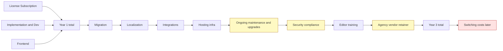

What drives CMS cost for mid‑market B2B sites (total cost of ownership)
Most of the TCO is not the CMS license; it’s the people and process around the CMS. License/subscription is usually 10–30% of 3‑year TCO; implementation, front‑end, integrations, content modeling, migration, localization, ongoing maintenance, security/compliance, training, and retainer overhead dominate the bill. For reference, 2026 benchmarks for mid‑market/corporate marketing sites put the initial build at roughly $15k–$75k (median ~$36.5k) and ongoing at $3.6k–$24k/year, with 3‑year TCO often double the initial build. 【turn16fetch0】

Acquia (a major Drupal vendor) sums it up: “Most organizations undercount by 40–60%” because dev sprints spent on patches, campaign delays, integration maintenance, and governance don’t show up on the invoice. 【turn18find1】

Below is a high‑level flow of how cost accumulates across a typical mid‑market B2B project (lines show “who pays what” and “where it compounds”):

1) Main cost categories (what you’re actually paying for)

- License/subscription: Recurring platform fees (often “per seat,” “per project,” or “per environment”). For SaaS headless/AEM this can scale with users, API calls, assets, or locales. For OSS (WordPress.org, Drupal, Strapi, Payload) the license is free, but you may pay for managed Cloud/Enterprise editions or support.
- Implementation & dev: Discovery, content modeling, backend plumbing, custom functionality, workflows, permissions, and QA. Often the single largest line item.
- Front‑end development: Templates, components, interactive elements, and responsive/accessible UI. For headless CMSs (Contentful, Sanity, Strapi, Payload) this is fully custom; for monoliths (WordPress, Drupal, AEM) it can use themes but still requires customization.
- Content modeling cost: Time to design future‑proof schemas and relationships. Enterprises “pay heavily when content models drift from business needs” and schema changes ripple through templates/plugins, incurring rework. 【turn19fetch0】
- Migration cost: Exporting, transforming, and importing existing content and media, plus preserving URLs, redirects, and SEO. Agencies treat migration as an ongoing discipline; SEO missteps can cause months of traffic loss. 【turn12search11】【turn12search5】
- Localization cost: Per‑locale translation workflow setup, TMS integration or native tools, and per‑locale platform fees (some vendors price by locale). Webflow’s localization is an add‑on with per‑locale pricing; headless typically requires integration with a TMS and API work. 【turn21search2】【turn21search0】
- Integration cost: Connecting to CRM, MAP, PIM, DAM, auth, analytics, etc. Each integration has build and ongoing maintenance cost and can become “integration debt” over time. 【turn19fetch0】
- Hosting & infrastructure: Managed hosting (e.g., WP Engine, Pantheon, Strapi Cloud, Webflow Cloud, Vercel/Cloudflare for Payload), or self‑hosted infra (servers, DB, CDN, staging environments). Mid‑market managed hosting often lands in the low‑to‑mid thousands per year for a single site; Pantheon notes $1k–$6k/month for mid‑market managed hosting (often multi‑site). 【turn26search8】
- Maintenance & upgrades: Patching, minor feature work, content/architecture adjustments, performance tuning, and monitoring. 2026 data shows $3.6k–$24k/year for a professional site. 【turn16fetch0】
- Security/compliance overhead: Audits, WAF/CDN policies, pen tests, and incident response. Legacy platforms can require $20k–$50k/year just for security management, as seen with Drupal 7. 【turn28fetch0】
- Editor training: Onboarding sessions, documentation, and ongoing enablement. Often under‑scoped; cost is labor‑hours and opportunity cost of a slower launch ramp.
- Agency/vendor retainers: Monthly SLAs and dev capacity for changes, bugs, and evolution. A common “hidden” line that can equal or exceed your platform subscription.
- Cost of vendor lock‑in: Proprietary schemas, custom APIs, and heavy reliance on vendor‑specific tooling make switching expensive. Lock‑in comes from high switching costs and contractual terms; migrations require data porting, retraining, and front‑end rework. 【turn15fetch0】
- Cost of changing CMS later: Export + rebuild front‑end + re‑integrate + retrain. Headless reduces some lock‑in but adds front‑end rework; monoliths tightly couple back/front‑end, which can increase migration effort. 【turn15fetch0】

2) What companies typically underestimate

Based on Acquia’s TCO analysis and enterprise implementation guides: 【turn18find1】【turn19fetch0】

- Ongoing maintenance & security: Dev sprints consumed by patches, plugin updates, and security incidents “never make it onto a balance sheet,” and organizations commonly undercount CMS TCO by 40–60%. 【turn18find1】
- Content modeling & operating model drift: Schema changes in legacy stacks ripple through templates and caches, causing rework; teams freeze models and use manual workarounds, inflating costs. 【turn19fetch0】
- Integration debt: Extensions that own core workflows (media, translation, automation) add upgrade/security overhead and “coordination tax.” 【turn19fetch0】
- Migration & SEO: Content porting plus URL/redirect strategy; poorly handled migrations can cause significant, long‑lasting traffic dips. 【turn12search5】【turn12search11】
- Localization complexity: Setup and per‑locale costs (tools, QA, legal review) are often missed; Webflow’s localization is priced as an add‑on per locale, and other headless CMSs require TMS integration and dev time. 【turn21search2】【turn21search0】
- Training & organizational change: Time for editors to become proficient, and process redesigns to match the new CMS workflow.
- Vendor lock‑in & future switching cost: Contractual lock‑in and switching costs (data porting, training, front‑end rebuild) are rarely modeled at purchase time. 【turn15fetch0】

3) Cost comparison matrix by CMS type

Notes: “Typical mid‑market B2B site” = a corporate marketing/lead‑gen site with 15–60 pages, some blog/resources, basic integrations (MAP/CRM/analytics), and 1–3 locales. 2026 rates used: US senior agency $125–$300/hr; EU $95–$225/hr. 【turn16fetch0】

Key
- $ = lower/controlled
- $$ = moderate
- $$$ = higher
- $$$$ = very high

Assumptions: Year‑1 TCO includes implementation + first‑year infra + platform; Year 2–3 adds maintenance, some upgrades, and training; ranges assume US/EU agency rates. AEM figures rely on partner/agency reports, since Adobe doesn’t publish list prices. 【turn22fetch0】【turn22fetch1】

| Cost category | WordPress (self‑hosted / managed) | Webflow | Contentful | Sanity | Drupal | AEM | Strapi | Payload |
|---|---|---|---|---|---|---|---|---|
| License/subscription | $ (OSS; managed plans ~$17.50–$25/mo Business/Commerce) 【turn8find0】 | $–$$ (Basic $15/mo; Premium $25/mo; Team $2,500/mo) 【turn2fetch0】【turn13fetch0】 | $$$ (Lite ~$300/mo mentioned in market analyses; Enterprise deals often $25k–$500k+/yr) 【turn20fetch0】【turn11search2】 | $$ (Growth $15/seat/mo; Enterprise custom; usage‑based overages) 【turn4fetch0】 | $ (OSS GPL) 【turn0search15】 | $$$$ (licensing typically low six‑figures/yr for mid‑market; custom) 【turn22fetch0】【turn22fetch1】 | $–$$ (Cloud Pro $90/project/mo; Scale $450; Enterprise Edition user‑based) 【turn6find2】 | $ (OSS MIT; Enterprise “Talk to Sales”) 【turn10click0】 |
| Implementation & dev | $–$$ | $–$$ | $$$ | $$–$$$ | $$–$$$ | $$$$ ($250k–$1M typical for builds, per partners) 【turn22fetch0】 | $$–$$$ | $$–$$$ |
| Frontend development | $–$$ (themes exist) | $–$$ (visual builder) | $$$ (headless, custom) | $$$ (headless, custom) | $$–$$$ | $$$$ (heavy component builds) | $$$ (headless, custom) | $$$ (headless, custom) |
| Content modeling | $$ | $–$$ (visual CMS) | $$–$$$ | $$–$$$ | $$–$$$ (powerful but complex) | $$$$ | $$–$$$ | $$–$$$ |
| Migration | $$ (many migration tools exist) | $$ | $$$ | $$$ | $$$ (version migrations common) | $$$$ | $$$ | $$$ |
| Localization | $$ (plugins/TMS) | $$–$$$ (add‑on per locale) 【turn21search2】 | $$–$$$ (TMS integration) | $$–$$$ (locales supported; GROQ/workflows add complexity) 【turn4fetch0】 | $$–$$$ (core multilingual, but setup heavy) | $$$$ | $$–$$$ (often via plugins/TMS) | $$–$$$ |
| Hosting/infra | $–$$ (shared/VPS; managed $50–$150/mo mid‑range; more for WP Engine/Pantheon) 【turn26search10】 | $ (included in site plan; can hit bandwidth/app‑request caps) 【turn13fetch0】 | $–$$ (if front‑end hosted elsewhere; depends on CDN/host) | $–$$ (usage‑based API/CDN, plus your front‑end host) 【turn4fetch0】 | $$–$$$ (mid‑market managed hosting often $1k–$6k/mo) 【turn26search8】 | $$$–$$$$ (multi‑layer Adobe‑centric infra) | $–$$ (Cloud plans include infra; self‑host similar to Payload) 【turn6find2】 | $–$$ (Cloud Standard/Pro if used; else infra costs) |
| Maintenance/upgrades | $$ (plugin/theme updates, compat) | $–$$ (platform handles core; custom code needs updates) | $$–$$$ (API versioning, schema evolution, QA) | $$–$$$ (schema/code changes, QA) | $$$ (version upgrades, security patches) | $$$$ (specialized devs, upgrades) | $$–$$$ | $$–$$$ |
| Security/compliance | $$ (good ecosystem, but frequent patching) | $–$$ (Webflow handles infra; customer manages access/app code) | $$–$$$ (you manage access, tokens, app security) | $$–$$$ (centralized RBAC/org tokens help, but you still own app security) 【turn19fetch0】 | $$$ (legacy security mgmt $20k–$50k/yr in some cases) 【turn28fetch0】 | $$$$ (enterprise tooling, audits) | $$–$$$ | $$–$$$ |
| Editor training | $ | $ | $$ | $$ | $$–$$$ | $$$ | $$ | $$ |
| Agency/vendor retainer | $–$$ | $–$$ | $$–$$$ | $$–$$$ | $$–$$$ | $$$$ | $$–$$$ | $$–$$$ |
| Vendor lock‑in risk | $$ (tight plugin/theme coupling; large installed base) | $$$$ (no code export on Site plans; front‑end coupled to Webflow runtime) 【turn21search8】 | $$$ (proprietary APIs, schema, ecosystem) | $$ (API‑first, code‑friendly schemas; portable data) | $$–$$$ (OSS but heavy investment in Drupal‑specific architecture) | $$$$ (deep Adobe ecosystem dependency) 【turn22fetch1】 | $$ (OSS with Cloud/Enterprise add‑ons) | $$ (OSS, Next.js‑centric, easier to self‑host) |
| Cost to change CMS later | $$ (many tools exist, but plugin/theme coupling makes migrations non‑trivial) 【turn15fetch0】 | $$$$ (likely full front‑end rebuild; export only on paid Workspace plans) 【turn21search8】 | $$$ (data is portable, but front‑end/integration rework needed) | $$$ (similar: data portable, front‑end/workflows to redo) | $$$ (often entails version upgrade and/or replatforming) | $$$$ (heavy integration and component rework) | $$$ | $$$ |

4 & 5) Practical budget ranges (with caveats)

Why there are no fully rigorous, CMS‑specific mid‑market TCO ranges
- Vendors price on usage (API calls, seats, assets, locales) and negotiate enterprise deals privately (AEM, Contentful Enterprise, Webflow Enterprise, Strapi Enterprise, Payload Enterprise), so public numbers are incomplete. Adobe doesn’t publish list prices; partners cite low six‑figures/yr license and $500k–$1M implementations. 【turn22fetch0】【turn22fetch1】
- Implementation cost is heavily driven by scope (number of content types, integrations, locales, custom components), not just by CMS choice. Drupal agencies and Pantheon explicitly state costs depend on features, integrations, and developer rates rather than the platform itself. 【turn26search2】【turn26search8】
- Geography and vendor type dramatically change hourly rates; 2026 benchmarks show a ~4x spread between US and APAC/LATAM agency rates. 【turn16fetch0】

With that caveat, below are grounded, indicative ranges for a “typical” mid‑market B2B corporate site (15–60 pages, 1–3 locales, a few integrations) to help you sense‑check proposals. These are not quotes—they’re qualitative ranges informed by 2026 web‑dev benchmarks and platform pricing pages. 【turn16fetch0】

- Initial build (design + implementation + CMS setup + front‑end + QA): $15k–$75k (median ~$36.5k). 【turn16fetch0】
- Year‑1 TCO (build + Year‑1 infra + platform fees + some training): roughly $25k–$110k.
- Ongoing (per year): $3.6k–$24k (including hosting, maintenance, security, analytics, and iterative improvements). 【turn16fetch0】
- 3‑year TCO: often ~2x the initial build. 【turn16fetch0】

CMS‑specific guidance (mid‑market B2B)

- WordPress (self‑hosted or managed):
  - Year‑1 TCO (typical): ~$30k–$80k. Platform: Business/Commerce plan ~$17.50–$25/mo. 【turn8find0】 Hosting (managed) can be ~$50–$150/mo mid‑range; more for high‑end providers. 【turn26search10】
  - Ongoing: ~$4k–$15k/year (hosting, maintenance, updates, security, retainer).

- Webflow:
  - Year‑1 TCO (typical): ~$25k–$70k. Platform: Premium Site plan $25/mo (yearly) for CMS‑heavy sites; localization is an add‑on per locale. 【turn2fetch0】【turn21search2】 Team plan $2,500/mo if you need governance/workflows. 【turn2fetch0】
  - Ongoing: ~$3k–$12k/year (plan, any add‑ons, some retainer or freelance support).

- Contentful:
  - Year‑1 TCO (typical): ~$50k–$150k+. Platform: Lite ~$300/mo mentioned in market analyses; enterprise deals often $25k–$500k+/yr. 【turn20fetch0】 Add front‑end build and integration work.
  - Ongoing: ~$10k–$50k+/year (platform, infra, dev maintenance, retainer).

- Sanity:
  - Year‑1 TCO (typical): ~$40k–$130k. Platform: Growth $15/seat/mo; Enterprise custom; API/CDN usage overages and add‑ons (e.g., $299/mo for higher quotas; $999/dataset/mo) can increase fees. 【turn4fetch0】
  - Ongoing: ~$8k–$40k/year (platform, infra, dev, retainer).

- Drupal:
  - Year‑1 TCO (typical): ~$40k–$120k. Platform: OSS (no license); managed hosting mid‑market often $1k–$6k/month per Pantheon. 【turn26search8】 Implementation is front‑loaded (custom modules, views, security). Legacy security management alone can reach $20k–$50k/year. 【turn28fetch0】
  - Ongoing: ~$8k–$35k/year (hosting, security, upgrades, retainer).

- AEM:
  - Year‑1 TCO (typical): ~$300k–$1M+. Partners report licensing typically starting in the low six figures annually and implementation $500k–$1M. 【turn22fetch0】【turn22fetch1】
  - Ongoing: ~$100k–$300k+/year (license, infra, specialized talent, maintenance).

- Strapi:
  - Year‑1 TCO (typical): ~$30k–$90k. Platform: Cloud Pro $90/project/mo; Scale $450; Enterprise Edition user‑based. 【turn6find2】 Self‑host incurs infra costs instead of Cloud fees.
  - Ongoing: ~$5k–$20k/year (Cloud/infra, dev, retainer).

- Payload:
  - Year‑1 TCO (typical): ~$30k–$90k. Platform: OSS (MIT); Cloud Standard often quoted around $35/mo and Pro ~$199/mo on G2; Enterprise custom. 【turn10click0】【turn14search0】
  - Ongoing: ~$5k–$20k/year (hosting/Cloud, dev, retainer).

6) Recommendations for mid‑market B2B decision makers

Start with outcomes, not platforms
- Define required locales, integrations, compliance regimes, and editorial workflows before choosing a CMS. Scope clarity reduces quoted variance by 30–50%. 【turn16fetch0】
- If your site is primarily a marketing/lead‑gen property, avoid over‑indexing on “composable DXP” features you won’t use; you’ll carry ongoing costs for capabilities that don’t move the needle. 【turn11search3】

Budget for TCO, not just Year‑1
- Use the “2x initial build over 3 years” heuristic as a sanity check, then adjust based on your planned integrations, localization, and compliance needs. 【turn16fetch0】
- Explicitly line‑item migration, localization, security, training, and retainer costs in RFPs and business cases. Acquia’s data suggests most orgs undercount CMS TCO by 40–60%. 【turn18find1】

Use this shortlist logic
- Want maximum control and are comfortable owning infra/DevOps: Shortlist WordPress (self‑hosted), Drupal, Strapi, Payload. They’re OSS with no license fees; cost shifts to dev and hosting. 【turn26search1】【turn24fetch0】
- Want a visual, low‑code approach for marketing and can live within Webflow’s runtime: Shortlist Webflow, but recognize switching later likely means a full front‑end rebuild (code export requires paid Workspace plans). 【turn21search8】
- Expect multi‑channel delivery and have engineering capacity: Shortlist Contentful, Sanity, Strapi, Payload. Contentful and Sanity are mature, API‑first platforms (Contentful more enterprise‑priced); Strapi/Payload are OSS, code‑centric alternatives. 【turn20fetch0】【turn11search3】【turn24fetch0】
- Already tied to Adobe marketing cloud at scale: AEM may be justified (though expensive); otherwise, it’s usually overkill for a single mid‑market B2B site. 【turn22fetch1】【turn11search14】

Mitigate lock‑in and future migration cost
- Prefer CMSs that treat content as structured data and expose stable APIs (Contentful, Sanity, Strapi, Payload). This keeps data portable and makes future platform switches primarily a front‑end/integration effort. 【turn19fetch0】【turn24fetch0】
- Standardize on widely used front‑end frameworks (e.g., Next.js) and avoid heavy use of vendor‑only tools or custom APIs in your presentation layer. 【turn24fetch0】
- Include a clause or exercise in your RFP for a data export and migration playbook; this alone will surface hidden lock‑in early.

Audit and continuously rationalize your stack
- Track dev time spent on CMS maintenance vs. feature delivery; Acquia’s warning signs (delays, security patches, ungoverned microsites) indicate a “maintenance tax.” 【turn18find1】
- Centralize media and reduce plugin/app sprawl to cut security/compliance overhead and integration debt. 【turn19fetch0】

Put it together
- For most mid‑market B2B sites, the biggest levers for TCO are scope control and front‑end architecture, not the CMS license. Use the ranges above to stress‑test vendor quotes, and insist that proposals break out content modeling, migration, localization, integrations, hosting, security, training, and ongoing retainer so you’re comparing like with like.