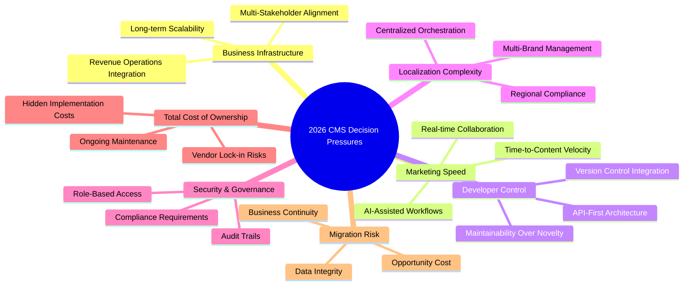

# 🔍 CMS Decision Pressures for Mid-Market B2B Companies in 2026

## 🧠 Executive Summary: Key Findings at a Glance

Based on analysis of 2026 industry reports and platform evaluations, CMS decisions have evolved from software choices into **strategic business infrastructure investments** for mid-market B2B companies. The convergence of AI, multi-channel demands, and operational complexity means selecting a CMS now impacts revenue operations, technical debt, and organizational agility. Below is a synthesis of the core pressures shaping these decisions.

## 📊 1. Why CMS Decisions Are Becoming Business Infrastructure Decisions

The 2026 landscape reveals a fundamental shift where CMS platforms are now viewed as **operational nervous systems** rather than simple content publishing tools. For mid-market B2B companies, this transformation stems from several converging factors:

- **Revenue Operations Integration**: Modern B2B companies require seamless connectivity between content management, customer data platforms, and revenue attribution systems. The CMS now serves as the central hub for orchestrating customer experiences across complex, multi-stakeholder buying journeys 【turn0search0】.
- **Multi-Stakeholder Alignment**: Unlike brochure sites of the past, today's CMS must serve marketing teams, developers, product managers, and regional stakeholders simultaneously. This requires sophisticated governance models and permission structures that align with organizational hierarchies 【turn0search12】【turn0search15】.
- **Long-term Scalability Requirements**: IT services, computer software, cybersecurity, and semiconductors—sectors generating $2.5 trillion in global B2B spending in 2026—demand platforms that can scale with complex business requirements 【turn0search2】. Enterprise teams designing for **governance, maintainability, and long-term scalability from the start** are prioritizing platforms that grow with their organizational complexity 【turn0search12】.

> 💡 **Strategic Insight**: "Enterprise custom web development for B2B organizations requires platforms that design for governance, maintainability, and long-term scalability from the start" 【turn0search12】. This perspective represents the new baseline for infrastructure decisions.

## ⚡ 2. Why Marketing Speed Matters

In 2026's competitive B2B landscape, **time-to-content velocity** directly correlates with market responsiveness and revenue opportunities. Marketing speed has become a competitive differentiator for several evidence-based reasons:

- **Real-time Collaboration Requirements**: Platforms like Sanity enable multiple team members to work on the same document simultaneously without conflicts, eliminating sequential bottlenecks in content production 【turn0search5】. This collaborative approach reduces publishing lags that previously extended to six weeks in inefficient content operations 【turn0search30】.
- **Multi-Channel Content Delivery**: With content needed across websites, mobile apps, in-app help widgets, and partner portals, centralized content management with API-first delivery ensures consistent messaging without redundant effort 【turn0search5】【turn0search32】.
- **AI-Assisted Workflows**: Modern CMS platforms now incorporate AI features for metadata generation, translation, and content optimization, dramatically accelerating repetitive tasks while maintaining quality standards 【turn0search5】. Builder.io's 2026 release added multi-region content orchestration for single-dashboard localization across 40+ markets, specifically designed to balance **marketing speed with engineering-grade precision** 【turn0search7】.

📊 Case Study: Marketing Speed Impact

Raft Labs' 2026 case study demonstrated that migrating high-traffic B2B SaaS websites to Sanity led to a **30% increase in organic traffic** while avoiding downtime during the transition. This performance improvement directly resulted from faster content updates, improved SEO agility, and reduced technical debt that had previously slowed marketing iterations 【turn0search5】.

## 🛠️ 3. Why Developer Control and Maintainability Matter

For mid-market B2B companies, **developer experience and long-term maintainability** have emerged as critical selection criteria, often outweighing initial feature sets. This shift recognizes that technical debt compounds rapidly without proper architectural foundations:

- **Content-as-Code Approaches**: Platforms like Sanity treat content models as code, allowing schemas to be defined using TypeScript or JavaScript and version-controlled alongside application code. This approach ensures consistency across environments and makes content infrastructure deployable like any other software component 【turn0search5】.
- **API-First Architecture**: Headless CMS platforms with robust REST and GraphQL APIs (such as Contentful, Hygraph, and Strapi) provide developers with the flexibility to build custom frontend experiences while maintaining content governance through the backend 【turn0search5】. This separation of concerns reduces maintenance complexity as frontend technologies evolve.
- **Maintainability as Selection Criterion**: As noted by industry experts, "Maintainability matters more than most teams will tell you: you won't..." 【turn0search11】. This recognition has led teams to prioritize platforms with clean APIs, comprehensive documentation, and predictable upgrade paths over those with impressive but brittle feature sets.

> 💡 **Developer Perspective**: "With Sanity, we can tailor the open-source Studio to meet our content production needs and delight our site visitors, and at the same time, use their Content Lake to host our content. We love the agility and 'no-ops happy meal' that Sanity delivers." – Chad Alderson, Head of Marketing Design & Engineering, DataStax 【turn0search5】

## 🌍 4. Why Localization and Multi-Brand Needs Increase CMS Complexity

The expansion into global markets and management of multiple product lines has transformed localization from a feature into an **architectural requirement** for mid-market B2B companies:

- **Centralized Orchestration**: Enterprise CMS platforms now need to manage **multi-brand storytelling across regions** 【turn0search15】. This requires sophisticated content modeling that can accommodate regional variations while maintaining brand consistency—a balance that traditional monolithic CMS platforms struggle to achieve.
- **Content Federation Capabilities**: GraphQL-native platforms like Hygraph enable content federation for integrating scattered data sources, particularly valuable for B2B companies with complex architectures spanning multiple systems 【turn0search5】. This capability reduces duplication while maintaining regional autonomy.
- **Built-in i18n Infrastructure**: Specialized headless CMS platforms like Hygraph offer built-in internationalization (i18n) infrastructure, eliminating the need for custom localization implementations that often become maintenance burdens 【turn0search17】. This is particularly important for B2B companies managing technical documentation across multiple markets.

| Platform | Localization Strengths | Best For |
|----------|----------------------|----------|
| **Hygraph** | GraphQL-native, content federation | Complex architectures with distributed data |
| **Contentful** | Multi-region support, governance tools | Large-scale SaaS with compliance needs |
| **Sanity** | Portable Text, AI-assisted translation | Developer-led teams with custom frontends |
| **Builder.io** | 40+ market orchestration | Marketing teams with global campaigns |

## 🔒 5. Why Security and Governance Are Becoming More Important

The increasing regulatory landscape and sophisticated threat environment have elevated **security and governance** from IT concerns to business-critical requirements in CMS selection:

- **Compliance Requirements**: B2B companies in regulated industries (healthcare, finance, public sector) now require platforms with **compliance-ready architectures** and audit trails 【turn0search9】. This includes data residency options, role-based access controls, and comprehensive logging capabilities.
- **Governance at Scale**: As content operations scale, governance becomes essential to prevent brand inconsistency and compliance violations. Enterprise CMS platforms now include sophisticated permission systems, approval workflows, and version control to manage content risk 【turn0search12】【turn0search16】.
- **Security as Foundation**: The selection of modern, production-ready technology stacks is increasingly focused on **security, maintainability, and long-term reliability** 【turn0search14】. This represents a shift from viewing security as a feature to recognizing it as a foundational architectural requirement.

## 💰 6. Why Total Cost of Ownership Matters More Than License Cost Alone

The 2026 landscape has matured to recognize that **initial licensing costs represent only a fraction** of true CMS investment. Comprehensive TCO analysis now dominates selection criteria for informed buyers:

- **Hidden Implementation Costs**: Beyond licensing, organizations must account for integration development, customization, data migration, and training expenses. As noted in industry analyses, "the purchase price is just the beginning" when calculating true ownership costs 【turn0search23】.
- **Ongoing Maintenance Burden**: A national B2B distributor case study highlighted how operating three outdated websites, each with its own CMS and vendor, created unsustainable maintenance overhead 【turn0search21】. This fragmentation multiplied support costs and created consistency challenges.
- **Vendor Lock-in Risks**: Proprietary platforms may impose significant switching costs through custom integrations and data structures. The shift toward composable architectures with open standards aims to reduce these long-term TCO implications 【turn0search28】.

📖 Detailed TCO Calculation Framework

A comprehensive TCO analysis for mid-market B2B CMS decisions should include:

1. **Initial Costs**:
   - License fees (annual/usage-based)
   - Implementation and integration
   - Data migration
   - Training and onboarding

2. **Operational Costs** (3-5 year horizon):
   - Platform maintenance and upgrades
   - Custom development and support
   - Performance optimization
   - Security monitoring and compliance

3. **Opportunity Costs**:
   - Time-to-market delays
   - Feature limitations
   - Competitive disadvantages
   - Staff productivity impacts

4. **Exit Costs**:
   - Data extraction and migration
   - Integration rework
   - Training on new platform
   - Temporary productivity losses

This framework reveals why the cheapest initial option often becomes the most expensive over a 5-year horizon 【turn0search20】【turn0search23】.

## ⚠️ 7. Why Migration/Replatforming Risk Matters During Website Rebuilds

The high failure rate of CMS replatforming projects has made **migration risk assessment** a critical component of selection decisions. Evidence suggests that the greatest risks occur before any development begins:

- **Pre-Build Failure Points**: As highlighted in industry analyses, "Replatforming fails before build. Highest risk sits here before any build begins. The visible brief can..." 【turn0search27】. This emphasizes that inadequate requirements gathering and stakeholder alignment derail projects before technical implementation starts.
- **Business Continuity Concerns**: For B2B companies dependent on their websites for lead generation and customer support, any downtime during migration represents direct revenue loss. Platforms that enable phased migrations and parallel environments significantly reduce this risk 【turn0search5】【turn0search26】.
- **Opportunity Cost Considerations**: "A slower, less flexible site may lose you conversions..." 【turn0search26】. This perspective recognizes that extended migration timelines not only incur direct costs but also prevent organizations from implementing revenue-enhancing features during transition periods.

> ⚠️ **Risk Warning**: "Because a migration is not a website rebuild. It's a rebuild of how..." 【turn0search24】. This insight emphasizes that CMS migration involves reimagining entire content operations and business processes, not simply technical reimplementation.

## 🎯 Implications for Mid-Market B2B Teams

Based on these pressures, mid-market B2B companies should consider several strategic implications:

1. **Cross-Functional Evaluation Committees**: CMS decisions now require input from marketing, IT, sales, legal, and regional stakeholders. Establish cross-functional evaluation teams early in the selection process to ensure all perspectives are represented 【turn0search12】【turn0search15】.

2. **Composable Architecture Preference**: Consider headless or composable CMS approaches that provide greater flexibility and reduced lock-in risks. These architectures better accommodate evolving requirements and multi-channel delivery needs 【turn0search5】【turn0search28】.

3. **Proof-of-Concept Requirements**: Before committing to platforms, conduct focused proofs-of-concept that test real-world scenarios including localization workflows, API integrations, and multi-stakeholder collaboration 【turn0search5】【turn0search17】.

4. **TCO-Focused Business Cases**: Develop comprehensive 5-year TCO models that include all implementation, maintenance, and opportunity costs. Present these to executive sponsors to ensure informed investment decisions 【turn0search20】【turn0search23】.

5. **Migration Risk Mitigation Plans**: Develop detailed migration strategies that include rollback procedures, parallel environments, and phased implementations. Prioritize platforms that facilitate these risk mitigation approaches 【turn0search26】【turn0search28】.

## 📝 Suggested Report Section Angle

**"The CMS as Operational Nervous System: Strategic Infrastructure Decisions for Mid-Market B2B Companies"**

This angle positions the CMS not as a content publishing tool but as the **central coordination platform** for increasingly complex B2B operations. The section would explore how modern CMS decisions impact revenue operations, technical debt, and organizational agility—framing selection as a business infrastructure investment with 5-10 year implications rather than a simple software choice.

The narrative would follow this structure:
1. **The Infrastructure Evolution**: How CMS platforms have evolved from publishing tools to operational nervous systems
2. **The Mid-Market Complexity Paradox**: Why companies between brochure sites and enterprise face unique pressures
3. **Decision Framework Integration**: How to balance speed, control, cost, and risk in selection criteria
4. **Implementation Implications**: What these pressures mean for practical selection and migration approaches
5. **Future-Proofing Considerations**: How to evaluate platforms against emerging requirements (AI, personalization, omnichannel)

This framing elevates the discussion from feature comparison to strategic business planning, providing executive sponsors with the context needed to make informed infrastructure investments that align with 2026 business realities.