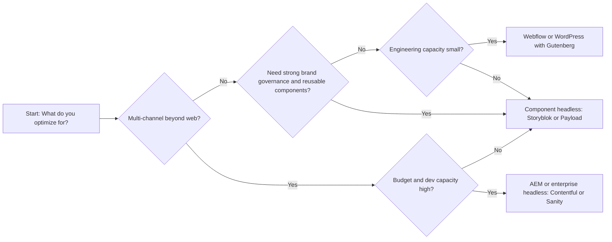

1) The main tension, explained
Marketing needs speed; engineering needs safety. Marketing wants to create pages, test campaigns, and iterate without opening tickets. Engineering needs typed schemas, version-controlled content models, repeatable builds, and deployments that don’t break at 17:00 on a Friday. Those goals pull in opposite directions.

Why marketing needs fast page creation and campaign publishing
- Time-to-market is a competitive lever. Campaigns, product launches, and localized offers have hard deadlines. If every landing page waits for engineering, revenue and pipeline lag. Modern visual tools (Webflow, Storyblok) exist specifically to let marketers ship pages without code changes. Webflow’s pitch is exactly this: designers and marketers can publish updates without waiting on developers【turn2fetch1】【turn5fetch1】.
- B2B buyers often self-educate on the website before contacting sales; fast content updates (pricing pages, customer stories, event pages) improve conversion.
- Marketing teams frequently operate across regions and agencies. Giving them publishing autonomy reduces the bottleneck and reduces error-prone handoffs.

Why engineering needs maintainable systems, structured content, typed schemas, version control, and clean deployments
- Maintainability and reliability. Untyped, free-form content stored as blobs (or in builder-specific shortcodes/JSON) becomes impossible to migrate, validate, or reuse. Engineering depends on schemas so they can refactor, test, and evolve the front-end safely.
- Version control and repeatability. Payload’s code-first approach explicitly avoids “click ops” so that content models are version-controlled alongside code, preventing drift between code and schema【turn3fetch0】. In many headless CMSes, if the CMS schema and the codebase diverge, the site can break.
- Clean deployments. CI/CD pipelines need predictable content structures, stable APIs, and explicit migration paths. Free-form builders or layout tools that embed logic inside pages break that.
- Multi-channel delivery. Structured content and typed schemas make it feasible to power web, mobile, POS screens, and partner portals from the same source (AEM’s headless docs emphasize exactly this use case via Content Fragment Models and GraphQL【turn2fetch5】).

Risks of page builders and unstructured content
- Performance and SEO. Page builders often ship extra scripts and heavy markup; benchmarks show page builders scoring lower in mobile PageSpeed than Gutenberg-based pages【turn5fetch0】. Performance directly affects SEO and conversion.
- Fragility and migration pain. Content tied to a specific builder’s internal format is hard to migrate. Practitioners report messy pages, broken layouts after theme or plugin updates, and slow reverts when they try to leave the builder【turn2fetch3】.
- Drift from brand/design system. Canvas-style page builders let marketers place anything anywhere, which erodes consistency and accessibility.

Risks of over‑engineered CMS setups that block marketers
- Slow time-to-value. AEM and Drupal can require long implementation cycles and niche skillsets; AEM’s total cost of ownership and steep learning curve are commonly cited downsides【turn7search1】.
- Developer dependency. Headless CMSes like Contentful provide strong structure and APIs but often lack native visual editing, forcing marketers to rely on developers for page layout【turn2fetch1】. Even Contentful users report limited visual preview and form-heavy UIs that frustrate editors【turn7search9】.
- Underused complexity. A recent headless-CMS guide describes Contentful as mature but rigid and warns that enterprise plans can be expensive and that many teams use only a fraction of the features【turn2fetch0】—classic over-engineering territory.

How headless + component‑based systems try to balance this
- Structured content + editable UI. Storyblok is architected around a component model with a visual editor that lets marketers assemble pages from pre-built blocks while staying inside a developer-defined schema【turn2fetch2】.
- Separation of concerns. Contentful, Sanity, and Payload separate content modeling (and sometimes hosting) from front-end rendering, enabling typed schemas, APIs, and CI/CD, while still offering editorial UIs and, in some cases, visual previews【turn2fetch5】【turn3fetch0】.
- Governance by design. AEM’s Content Fragment Models and GraphQL API let architects define typed, reusable content, then deliver it to any front-end【turn2fetch5】. Component-based stacks (Next.js + Storyblok/Sanity/Payload) mirror this but with smaller cost and complexity.

How organizations should define ownership (marketing, engineering, agency, product)
- Product/Engineering owns: content model, component library, CI/CD and hosting, access controls, and non-negotiable guardrails (performance budgets, security, accessibility).
- Marketing/Content owns: editorial calendar, copy and assets, page assembly within guardrails, A/B tests and campaigns, and localization briefs.
- Agency owns: implementation (build) and handoff, plus runbooks; it should not own the platform architecture long-term.
- A RACI matrix helps. Example: Content type changes—Engineering (Accountable), Product (Responsible for requirements), Marketing (Consulted), Agency (Informed). Campaign landing pages—Marketing (Accountable), Engineering (Responsible for components), Agency (Consulted during build).

2) CMS category comparison

To make the trade-offs tangible, here’s how each platform typically balances marketing autonomy vs engineering control.

WordPress + page builders (Elementor, Divi, Beaver Builder, etc.)
- Marketing autonomy: High. Page builders let non-technical users drag-and-drop layouts and publish quickly, especially for landing pages【turn2fetch3】.
- Engineering control: Low-to-moderate. Content is often stored in builder-specific shortcodes/JSON. Structure is informal; versioning is weak; migrations are painful. Page builders add performance overhead and can hurt PageSpeed scores vs Gutenberg-based builds【turn5fetch0】.
- Risks: Technical debt, lock-in to a builder/plugin ecosystem, SEO and performance issues, and reliance on many plugins【turn4search16】.
- Best fit: Marketing-heavy teams that prioritize speed over multi-channel reuse and have limited engineering bandwidth. Acceptable only with strict governance (e.g., builders restricted to landing pages; core content in Gutenberg; few plugins).

Webflow
- Marketing autonomy: High. Webflow is a visual website builder with a built-in CMS; marketers can design, build, and publish without engineering for many marketing-site needs【turn2fetch1】【turn5fetch1】.
- Engineering control: Moderate. Webflow provides structured Collections with typed fields and references, but it couples hosting and rendering, and it has scale limits (e.g., 20k CMS items, 40 collection lists per page, no native cross-collection queries)【turn5fetch1】.
- Risks: Lock-in to Webflow’s hosting and rendering; limited for complex relational data or multi-channel; scaling ceiling for large catalogs【turn5fetch1】.
- Best fit: Design-led B2B marketing sites, product marketing pages, and portfolio/case-study sites where marketing needs independence but content relationships stay moderate.

Contentful
- Marketing autonomy: Low-to-moderate. Strong editorial workflows and collaboration, but no native visual page builder; marketing generally works in forms and needs engineering to render pages【turn2fetch1】.
- Engineering control: High. Structured content types, APIs, multi-environment publishing, and CI/CD-friendly content model. Pricing and limits can be restrictive as you scale【turn2fetch0】【turn7search9】.
- Risks: Cost and complexity; vendor critics highlight limited visual preview and governance overhead, plus rate limits that affect CI/CD during builds【turn7search9】.
- Best fit: Mid–large B2B organizations with serious multi-channel needs and engineering capacity, but you must budget for building (and maintaining) the editorial experience.

Sanity
- Marketing autonomy: Low-to-moderate. Studio is a React app you fully control, so you can build great editing UX, but it requires upfront dev investment. It’s powerful, not plug-and-play【turn2fetch0】.
- Engineering control: Very high. Schema-as-code, GROQ query language, real-time collaboration, and strong typing. Designed for content operations at scale【turn2fetch0】.
- Risks: Overkill for a simple marketing site; rewards teams that treat content modeling as a product discipline【turn2fetch0】.
- Best fit: Complex content operations, multi-channel delivery, or product-led teams with strong front-end chops.

Storyblok
- Marketing autonomy: High. Visual editor lets marketers compose pages from pre-defined components with live preview while staying within a structured model【turn2fetch2】.
- Engineering control: High. Component-based content, typed schemas, and headless APIs. You control the front-end and deploy however you want.
- Risks: Architectural constraints if you outgrow “marketing site” patterns and need more complex content graphs【turn2fetch0】.
- Best fit: Mid-market B2B marketing sites that want both marketing self-service and structured, reusable content.

Payload CMS
- Marketing autonomy: Moderate. Admin panel is clean and usable, but schema changes are code-first and require engineering【turn3fetch0】.
- Engineering control: Very high. Code-first, version-controlled schemas; self-hostable; Next.js-native; avoids click-ops drift【turn3fetch0】.
- Risks: Higher initial dev investment; you must build and maintain the editorial experience.
- Best fit: Teams with strong engineering that want full ownership and a modern stack, and are willing to invest in tooling for editors.

Drupal
- Marketing autonomy: Variable. Traditionally developer-heavy, but recent Drupal CMS 2.0 adds a visual page builder (Canvas) aimed at marketers and claims drag-and-drop site creation in minutes【turn2fetch4】. Contrib page-builder tools also exist【turn4search13】.
- Engineering control: High. Robust access control, workflows, and structured content; used by enterprises and governments that need strong governance【turn7search5】.
- Risks: Complexity and perception of difficulty; implementation often requires specialized agencies【turn7search5】【turn7search6】.
- Best fit: Organizations that need strong governance, complex permissions, and have (or can afford) Drupal expertise.

AEM (Adobe Experience Manager)
- Marketing autonomy: Moderate in Sites mode (templates, components, workflows), but constrained by IT governance and implementation complexity【turn2fetch5】【turn4search1】.
- Engineering control: Very high. AEM supports headless via Content Fragment Models, GraphQL, and APIs for structured, channel-neutral content【turn2fetch5】.
- Risks: High TCO and steep learning curve; often described as over-engineered for mid-market【turn7search1】【turn4search7】.
- Best fit: Large enterprises with Adobe ecosystem investments and dedicated AEM teams; generally overkill for mid-market B2B marketing sites.

Summary table: marketing autonomy vs engineering control (typical)

| Platform        | Marketing autonomy | Engineering control | Notes |
|-----------------|--------------------|---------------------|-------|
| WP + page builders | High | Low–Moderate | Fast campaigns, but tech debt and performance/SEO risks【turn5fetch0】【turn2fetch3】. |
| Webflow         | High              | Moderate            | Visual builder + structured Collections; scale limits; coupled hosting【turn5fetch1】. |
| Contentful      | Low–Moderate      | High                | Structured, multi-channel; expensive; limited visual editing【turn2fetch1】【turn7search9】. |
| Sanity          | Low–Moderate      | Very high           | Schema-as-code; powerful but requires dev investment【turn2fetch0】. |
| Storyblok       | High              | High                | Visual editor + component constraints; ideal for mid-market marketing sites【turn2fetch2】【turn2fetch0】. |
| Payload CMS     | Moderate          | Very high           | Code-first; version-controlled schemas; you build the editing UX【turn3fetch0】. |
| Drupal          | Low–Moderate→High (with CMS 2.0) | High | Visual builder emerging; strong governance but complex【turn2fetch4】【turn7search5】. |
| AEM             | Moderate          | Very high           | Enterprise DXP; headless-capable but high TCO and complexity【turn2fetch5】【turn7search1】. |

3) Decision framework

Use this flowchart as a starting point. For mid-market B2B, the “Component headless with visual editor” path often hits the sweet spot.

Scoring aid (rate 1–5)

- M1: Marketing autonomy needed (campaign velocity, self-service pages, agency usage)
- E1: Engineering control needed (typed schemas, versioned models, CI/CD, multi-channel)
- T1: TCO sensitivity (budget for licenses, implementation, and ongoing maintenance)
- O1: Org maturity (do you have a product/eng team that can own a component system and design system?)
- R1: Reuse requirement (how many channels need the same structured content?)

How to interpret scores
- High M1 + low E1 + low–moderate T1: Webflow; WordPress/Gutenberg for smaller budgets.
- High E1 + high O1 + high R1: Payload or Sanity (if dev capacity is strong), or Contentful if you’re comfortable with cost and can build a good editorial UX.
- Balanced M1/E1 with mid T1 and R1: Storyblok is often the best fit; it offers visual editing within a component model【turn2fetch2】【turn2fetch0】.
- Enterprise-scale with existing Adobe stack or very high compliance needs: AEM (but recognize the TCO/complexity risk)【turn2fetch5】【turn7search1】.
- Strong governance and complex permissions with available expertise: Drupal (especially with CMS 2.0’s visual tools)【turn2fetch4】.

4) Recommendations for mid‑market B2B teams

- Default toward component headless with a visual editor. For most B2B marketing sites, this gives marketing the self-service they need (landing pages, case studies, localized pages) and engineering the structure they need (typed schemas, versioned models, clean front-end builds). Storyblok is the archetype here【turn2fetch2】【turn2fetch0】.
- When you have strong engineering capacity and want full ownership, consider Payload. Its code-first, version-controlled approach is ideal if you’re willing to invest in building an editor experience that suits your marketing team【turn3fetch0】.
- Use Webflow when design is central and content relationships are moderate. Webflow is excellent for marketing-led teams that want autonomy and a clean SEO baseline, but be mindful of its scale limits and vendor coupling【turn5fetch1】.
- Use WordPress carefully. Prefer Gutenberg over page builders for performance and long-term maintainability; if you must use a page builder, restrict it to isolated landing pages and enforce governance (approved components, limited plugins, regular audits)【turn5fetch0】【turn2fetch3】.
- Treat Contentful/Sanity/AEM/Drupal as “big bets.” They’re powerful but expensive and complex; they pay off when you have clear multi-channel needs, compliance requirements, or existing ecosystem commitments【turn2fetch0】【turn2fetch5】【turn7search1】.
- Codify ownership early. Decide who owns the content model, component library, hosting/CDN, and release process. Use RACI, document “what changes need engineering,” and keep that list short. A well-maintained component library is the contract that lets marketing move fast without breaking things.

If you share your team size, agency involvement, and whether you need multi-channel delivery, I can turn this into a concrete shortlist and outline a migration path from your current setup.