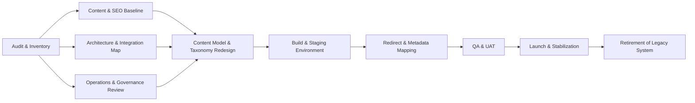

What I’ll cover
- 1) Migration risk matrix (compact, by platform)
- 2) Platform-specific risks (per source CMS)
- 3) Common patterns across migrations
- 4) Recommendations before you start a website rebuild
- 5) How this applies to mid‑market B2B companies

Note: “Moving away from X” means X is the source you’re leaving. Risks are about the move itself, not the target. I keep target-agnostic where possible because the target changes the risk profile a lot (e.g., WordPress→Webflow is different from WordPress→headless).

---

## 1) Migration risk matrix by platform

Ratings: Low (L) | Medium (M) | High (H) | Very High (VH).

| Risk dimension (source platform) | Wix | Squarespace | WordPress | Webflow | Drupal | AEM | Contentful | Sanity | Strapi |
|----------------------------------|-----|-------------|-----------|---------|--------|-----|------------|--------|--------|
| Typical mid‑market B2B profile | Early‑stage, low dev bandwidth; non‑technical marketing; simple pages/blog | Design‑led B2B (agencies, consultants); content mostly pages + blog + light commerce | Marketing/engineering hybrid; 50–500 pages; plugins, ACF, custom post types; some integrations | Design‑first B2B (agencies, SaaS marketing sites); strong visuals; smaller teams | Technical B2B (SaaS, media, associations); complex roles; multi‑lang; performance/security needs | Large global B2B (manufacturing, tech, pharma); multi‑brand, multi‑region; Adobe ecosystem | Content‑led B2B with omnichannel needs; dev‑heavy; multi‑lang; composable stack | Developer‑heavy B2B (SaaS, product marketing); content model is central; multi‑channel frontends | Dev‑heavy B2B startups/scale‑ups; self‑hosted headless; custom frontends |
| Why they outgrow it | Performance ceilings; rigid templates; limited integrations; cost creep with apps | Rigid layouts; limited customization; commerce constraints; single‑site focus | Plugin sprawl; monolith coupling; security/maintenance burden; performance; authoring at scale | CMS limits; per‑site pricing for multisite; need for programmatic SEO or complex personalization | High dev cost to change; steep learning curve; upgrade/migration fatigue; complex governance | License cost; slow releases; specialized talent needed; overhead for simpler use cases | Cost at scale; over‑engineering for simple web; preview/edit reliability complaints; complex workflows | Need for stronger visual editing or cheaper total cost; workflow customization; front‑end flexibility | Need for more out‑of‑the‑box features (e.g., enterprise permissions, granular localization, hosting control) or less dev maintenance |
| Migration difficulty | H | M–H | M–H | M–H | H–VH | VH | H | H | M–H |
| Content export limitations | Limited to RSS/XML for blog; no native “export all pages/images” (rebuild, not transfer)【turn0search18】 | Export is XML (mainly blogs) + CSV (products); page layouts/code not exportable; 7.1 removed some legacy export paths【turn2search0】【turn2search1】【turn4search8】 | Good (XML/CSV); but serialized plugin data (ACF, page builders) complicates structure; media links embedded in content often break if URLs change【turn3search9】 | CMS export via CSV (per collection); code export doesn’t include CMS or runtime (must rebuild or script around)【turn2search5】【turn4search5】【turn2search9】 | Export via Migrate API; highly structured but tied to Drupal data model; complex custom content types need custom scripts【turn4search1】【turn7search19】 | Content Transfer Tool for AEM→AEM; general outbound export is custom (packages/API) and non‑trivial; many proprietary formats【turn6search9】【turn6search10】【turn6search12】 | Strong CLI/API export (content + assets + content model)【turn7search10】【turn7search13】【turn7search11】; complex reference graphs need careful scripting | Good API/CLI export; migrations typically require custom scripts to map schemas and Portable Text to new target【turn7search0】【turn7search1】 | Import‑Export Entries plugin exists but requires identical content types/fields between environments; general outbound export is custom scripting/API【turn7search5】 |
| SEO risks | H: Wix controls sitemap/structure; changing URLs triggers redirect need; canonical customization can remove pages from sitemap【turn3search2】【turn3search13】【turn6search1】 | M–H: changing URL patterns breaks rankings if redirects aren’t 1:1; no native hierarchy in 7.1; limited structured data options | M–H: URL changes, plugin removal (e.g., SEO plugins), and theme change can tank rankings if redirects, meta, and schema are lost | M: Webflow’s clean code often improves technical SEO, but URL changes and redirect loss still hurt if mismanaged【turn0search15】 | M: Drupal is SEO‑capable but migrations often change path aliases/taxonomies; module changes can break schema/sitemaps【turn1search1】【turn7search17】 | M–H: custom URL mapping, complex rendering, and multi‑site setups make redirect governance critical; Adobe tooling helps AEM→AEM, not AEM→other【turn6search9】【turn6search12】 | H: headless migrations risk 30–60% traffic drops without careful redirect modeling and front‑end SEO parity (meta, schema, sitemaps, pagination)【turn0search10】【turn1search13】 | H: same headless SEO pattern; redirects and front‑end rendering must preserve link equity and indexability【turn0search10】【turn7search4】 | M–H: typical headless risks; plus Strapi’s self‑hosted nature means you also handle infrastructure/CDN impacts on crawl and speed |
| URL/redirect risks | H: Wix auto‑redirects when you change structure, but moving off‑platform requires manual mapping; group redirects exist but limits exist; many URLs change anyway【turn3search13】【turn3search14】【turn3search16】 | M–H: no bulk redirect export from Squarespace; you must inventory URLs in a spreadsheet and recreate redirects on new platform【turn0search8】【turn0search5】【turn0search6】 | M: easier export of URLs and redirect lists, but WordPress plugins’ redirect tables must be migrated and 1:1 mapped; internal linking often hardcoded | M: Webflow supports 301 import/export, but moving off Webflow requires re‑implementing in infrastructure (CDN/hosting) and avoiding chains【turn0search16】【turn4search5】 | M–H: legacy aliases, custom paths, and query‑parameter routes require careful migration; Redirect module mappings must be recreated【turn7search17】【turn7search16】 | H: complex rewrite rules, multi‑site/multi‑lang path structures, and legacy aliasing demand inventory and governance; risk of chains if multiple migrations occurred | H: URL strategy lives in front‑end, not CMS; must be rebuilt and tested; redirect management is custom in headless【turn1search12】【turn1search13】 | H: same headless challenge; composable redirect services exist, but teams often underestimate mapping work【turn1search12】【turn7search4】 | M–H: headless + self‑hosted means you implement redirect layer; risk of gaps if not systematically mapped |
| Media migration issues | H: images often embedded; no bulk export; must scrape or re‑upload; focal points/variants lost | M–H: images export is limited; focal crops and variants are often lost; layouts aren’t exported【turn2search0】 | M: Media Library export is possible; embedded media URLs often break after domain/host change; serialized data in DB needs search/replace【turn3search9】 | M: assets are manageable (CSV + bulk upload), but responsive variants must be re‑created if you leave Webflow’s CDN pipeline【turn6search6】【turn6search7】 | M: media is referenced by entity/field; migration scripts must move files + update references; dynamic image styles must be reimplemented | H: AEM assets include metadata, renditions, and Dynamic Media configurations; outbound migration risks losing those associations | M–H: assets export well via API; but you must map to new DAM and update references; focal points/variants need re‑implementation | M–H: image references live in Portable Text; migration must update references and ensure new front‑end renders consistently | M: assets are files + DB references; custom media fields can complicate export; you must reimplement any processing pipeline |
| Content modeling issues | L–M: Wix’s data model is hidden; minimal modeling; migration is mostly flat pages/blog; custom data structures require reimplementation | L–M: Squarespace has limited modeling; mostly pages + blog + products; mappings are straightforward but not rich | M–H: ACF/page‑builders create implicit models; moving to structured CMS requires explicit modeling and cleanup; relationships often implicit | M: Webflow’s collection model is explicit and exportable, but cross‑collection references and conditional visibility need rethinking in target | H: complex entity types, fields, and references must be mapped to a new model; Drupal‑specific concepts (nodes, paragraphs, views) don’t exist elsewhere | H: AEM’s page/component/asset model is deep; migrating away requires decomposing templates, policies, and references into the target’s abstractions | M–H: content model is flexible; risk is drift (types, validations, references) over time; migration must reconcile that drift【turn2search10】【turn1search11】 | M–H: Portable Text and references are powerful but migration‑heavy; need to map custom schemas and nested objects precisely【turn7search0】【turn7search1】 | M–H: Strapi models are open; but without strict governance they can drift; migration must align source/target schemas【turn7search5】 |
| Workflow/permission issues | M: basic roles, no complex workflows; migration is usually about recreating basic access in new CMS | M–M: limited workflows; mostly publish/draft; new platform may expose more options, requiring retraining | M–H: custom role/capability plugins may not have equivalents; editorial workflows (e.g., custom statuses) must be reimplemented | M–M: Webflow has simple team roles; migration is more about content transfer than complex permissions | H: Drupal has granular permissions and workflows; replicating this in simpler CMSes loses capability; in complex ones, it’s costly to rebuild | VH: AEM workflows, permissions, and launches are deeply integrated; migrating away requires extensive re‑engineering of approval processes | M–H: workflows are often custom built on webhooks/apps; moving away requires replicating or redesigning those flows【turn1search11】 | M–H: similar to Contentful; heavy reliance on custom front‑end workflows; migration to a non‑headless stack may require new governance model | M–H: permissions are configurable but often customized; migrating away requires auditing and reimplementing policies; audit trails may be lost |
| Integration risks | H: Wix integrations are proprietary “apps”; moving off means replacing them with APIs; any custom Velo code is hard to port | M–H: Squarespace has fewer native integrations; you’ll likely rebuild integrations via API or Zapier on new platform | M–H: WordPress plugins provide integrations; you’ll need API‑based replacements; legacy REST endpoints might be consumed externally | M–M: Webflow has webhooks and Zapier; but complex ERP/CRM integrations require custom development; some are natively supported (e.g., HubSpot) | M–H: Drupal often integrates via custom modules and services; those must be rebuilt or replaced with SaaS connectors | VH: AEM is often tied into Adobe stack and legacy systems; decoupling requires significant integration rework and testing【turn1search7】 | M–H: well‑suited for composable stacks; migrating away means reconnecting webhooks/apps and may change data shape for consumers | M–H: similar to Contentful; strongly API‑first; consumers expect certain response shapes; changing that can break downstream apps | M–H: self‑hosted; integrations are often custom REST/GraphQL; migrating away requires audit and re‑wiring |
| Cost (mid‑market B2B, typical range) | $10k–$30k to rebuild; can balloon with many pages or custom features | $12k–$40k depending on page count and integrations; often done with a redesign | $20k–$80k+ (content + plugin replacement + redesign); simple moves cheaper; headless moves at top end【turn5search5】【turn5search17】 | $15k–$60k depending on collections and templates; leaving Webflow often needs front‑end rebuild【turn5search6】 | $30k–$120k+; complex migrations to modern stacks (headless/Next) typically 12–28 weeks【turn1search2】 | $150k–$500k+ including content, integrations, and parallel environments; TCO often exceeds $1M over three years for mid‑size【turn5search10】【turn5search11】 | $40k–$150k+ depending on content volume, localization, and front‑end rebuild; integration re‑plumbing adds cost | $40k–$150k+; high if also rebuilding front‑end and re‑doing Portable Text mapping | $30k–$120k+; lower license fees, but custom dev and infra set‑up add cost |
| Timeline (mid‑market B2B) | 6–12 weeks | 8–14 weeks | 10–20 weeks; headless 16–28 weeks【turn1search2】 | 8–16 weeks | 12–28 weeks (headless/next gen)【turn1search2】 | 6–18+ months, often phased【turn1search2】【turn1search7】 | 10–20 weeks | 10–20 weeks | 10–20 weeks |

---

## 2) Platform-specific risks (moving away from X)

I’ll focus on what’s non‑obvious or especially painful for each source.

### Wix
- Typical profile: early‑stage B2B with non‑technical marketing; simple site + blog.
- Why outgrow: performance ceilings; limited design/code control; app‑based integrations become expensive and brittle; templates resist structural changes.
- What makes migration difficult: there’s no true “export my whole site.” Wix to Webflow is explicitly a rebuild, not a transfer【turn0search18】.
- Content export limitations: limited to RSS/XML for blog; no canonical export of all pages or images; metadata is partially exportable but often requires manual mapping.
- SEO risks: moving off Wix almost always changes URLs. Wix can auto‑redirect on its own platform when you change URL structure【turn3search13】, but those redirects don’t travel with you. You must recreate 301s and keep link equity, or you can lose significant traffic【turn0search2】. Canonical customization can also remove pages from Wix’s sitemap if misconfigured【turn3search2】.
- URL/redirect risks: Wix URLs include prefixes/structures that may not match your target; you must inventory and map 1:1; Wix’s group redirect tool is useful while on Wix, but irrelevant once you leave【turn3search14】【turn3search16】.
- Media migration: no bulk image export with variants/focal points; you’ll likely scrape or re‑upload, and lose Wix‑specific optimizations.
- Content modeling: mostly flat pages + blog; the risk is underestimating how much implicit structure (e.g., repeated page patterns) must be modeled explicitly in the new CMS.
- Workflow/permissions: Wix’s roles are simple; risk is low, but you’ll still need to set up equivalent access in the new system.
- Integrations: Wix “apps” are proprietary; you’ll need API‑based replacements (e.g., forms, CRMs, analytics).
- Cost/timeline: often 6–12 weeks; $10k–$30k if mostly rebuild; more if many custom pages and features.

### Squarespace
- Typical profile: design‑led B2B (agencies, consultants); content is mostly pages + blog + light commerce.
- Why outgrow: limited layout flexibility and developer access; commerce features are constrained; multi‑site and advanced personalization are difficult.
- What makes migration difficult: Squarespace exports are XML (blog) and CSV (products), but page layouts, styles, and code are not exportable【turn2search0】【turn2search1】. You typically rebuild templates.
- Content export limitations: blogs as XML; products as CSV; portfolios and page layouts not exportable; 7.1 removed some legacy export paths【turn4search8】.
- SEO risks: any change to URL patterns or hierarchy can break rankings if redirects are missing or not 1:1. Forums and guides emphasize cataloging URLs before moving and setting up 301s【turn0search5】【turn0search6】【turn0search8】.
- URL/redirect risks: Squarespace doesn’t export redirect rules; you must build the redirect map from a URL inventory (often via spreadsheet) and recreate on new platform.
- Media migration: focal crops and responsive variants are usually lost; images must be re‑uploaded; product image relationships need remapping.
- Content modeling: low complexity in Squarespace; the risk is that your new CMS offers richer modeling, which can lead to over‑engineering if not constrained.
- Workflow/permissions: limited workflows to begin with; migration rarely adds risk here.
- Integrations: fewer native integrations; you’ll often rebuild via APIs/Zapier, which is generally straightforward.
- Cost/timeline: 8–14 weeks; $12k–$40k depending on page count/commerce.

### WordPress
- Typical profile: hybrid marketing/engineering teams; 50–500 pages; heavy plugin use; custom post types via ACF/page builders.
- Why outgrow: security and maintenance overhead; plugin conflicts; monolith coupling; performance at scale; need for omnichannel/headless.
- What makes migration difficult: the site is often a tangle of plugins, shortcodes, and serialized data (e.g., ACF fields, page builders). Moving to a structured/headless CMS requires disentangling this.
- Content export limitations: WordPress XML/CSV exports are robust, but plugin‑specific data structures are not part of core exports. Media references in content are often hardcoded and break if URLs change【turn3search9】.
- SEO risks: theme or plugin changes can alter URLs, meta, schema, and internal links. If redirects and metadata aren’t preserved, rankings drop. Moving to headless introduces additional front‑end SEO responsibilities (meta, schema, sitemaps, pagination)【turn3search6】【turn3search10】.
- URL/redirect risks: redirect plugins (e.g., Redirection) store rules in custom tables; these must be exported, deduplicated, and imported into the new platform.
- Media migration: Media Library can be exported, but you must update embedded URLs and serialized references; this often requires DB search/replace scripts【turn3search9】.
- Content modeling: ACF/page builders create implicit content models; you must design explicit models in the new CMS, which is a major source of scope creep.
- Workflow/permissions: custom roles/capabilities may not have equivalents; editorial workflows need reimplementation.
- Integrations: plugins provided ready‑made integrations; moving away means replacing them via APIs or middleware.
- Cost/timeline: 10–20 weeks for a typical move; 16–28 weeks for headless; $20k–$80k+ depending on complexity【turn1search2】【turn5search17】.

### Webflow
- Typical profile: design‑first B2B (SaaS marketing sites, agencies) that want clean code and visual editing.
- Why outgrow: CMS complexity limits; per‑site pricing for multisite; need for programmatic SEO, personalization, or headless delivery.
- What makes migration difficult: code export is possible, but CMS and editor functionalities are not included【turn4search5】【turn2search9】. Leaving Webflow usually means rebuilding the CMS layer or scripting around CSV exports.
- Content export limitations: CMS collections export as CSV (text, references, rich text as HTML); relationships can be mapped during import【turn2search5】. No out‑of‑the‑box export for CMS‑generated pages as HTML.
- SEO risks: Webflow is generally SEO‑friendly and migrations to Webflow often improve rankings if done correctly【turn0search15】. Leaving Webflow risks URL changes and lost 301s if redirect mapping isn’t maintained; Webflow’s 301 import/export is useful only while on Webflow【turn0search16】.
- URL/redirect risks: redirects are well‑supported inside Webflow; off‑platform, you must implement and host the redirect layer (e.g., edge/CDN rules) and avoid redirect chains.
- Media migration: assets can be exported with code, but Webflow’s responsive image variants (srcset/sizes) won’t automatically transfer【turn6search7】.
- Content modeling: collections and references are explicit; migration risk is moderate, but cross‑collection logic and conditional visibility need reimplementation.
- Workflow/permissions: simple team roles; low risk.
- Integrations: Webflow supports webhooks and some native integrations; complex ones need custom development.
- Cost/timeline: 8–16 weeks; $15k–$60k depending on collections and whether you also rebuild the front‑end.

### Drupal
- Typical profile: technical B2B (SaaS, publishers, associations); complex roles, multi‑language, high security/performance needs.
- Why outgrow: high dev cost for changes; steep learning curve; upgrade fatigue (e.g., D7→D10); need for composable/headless or easier authoring.
- What makes migration difficult: data is deeply structured (nodes, fields, paragraphs, views, taxonomies). Migrating out of Drupal usually requires the Migrate API and custom scripts, especially from older versions【turn4search1】【turn4search3】.
- Content export limitations: powerful but technical; you must map each entity/field to the target’s content types; legacy data often needs transformation.
- SEO risks: Drupal is SEO‑capable, but migrations can break path aliases, taxonomy hierarchies, and module‑dependent schema/sitemaps【turn1search1】【turn7search17】.
- URL/redirect risks: legacy URL patterns (including query parameters and path aliases) require careful mapping; Drupal’s Redirect module data must be migrated or recreated【turn7search16】【turn7search18】.
- Media migration: media entities and image styles must be reimplemented; references in content need updating.
- Content modeling: Drupal’s model is rich and flexible; simplifying it for a new CMS can lose capability, while replicating it is costly.
- Workflow/permissions: Drupal’s granular permissions and workflows are hard to replicate fully elsewhere; audit trails may be lost.
- Integrations: custom modules and services must be rebuilt or replaced with SaaS; often tightly coupled.
- Cost/timeline: 12–28 weeks for modern headless; $30k–$120k+ depending on complexity【turn1search2】.

### Adobe Experience Manager (AEM)
- Typical profile: large global B2B (manufacturing, tech, pharma); multi‑brand, multi‑region; Adobe ecosystem integrations.
- Why outgrow: high license + talent cost; slow release cycles; specialized skill requirements; overhead for marketing sites that don’t need full DXP.
- What makes migration difficult: AEM’s page/component model, workflows, permissions, and asset management are deeply proprietary. Adobe provides Content Transfer Tool for AEM→AEM Cloud, but not for AEM→other【turn6search9】【turn6search10】【turn6search12】.
- Content export limitations: outbound export is not trivial; content, assets, and metadata are tightly coupled to AEM’s repository; custom code is usually required.
- SEO risks: AEM sites often have complex rendering, personalization, and multi‑site URL rules; mis‑mapping these during migration can cause massive ranking losses if redirects and metadata aren’t preserved.
- URL/redirect risks: multi‑language, multi‑site path structures and legacy rewrite rules demand rigorous inventory and governance; risk of redirect chains if multiple prior migrations exist.
- Media migration: assets include metadata, renditions, and Dynamic Media configurations; outbound migration risks losing those associations.
- Content modeling: deeply nested templates, components, and policies must be decomposed into the target’s abstractions; labor‑intensive and error‑prone.
- Workflow/permissions: highly customized approval workflows and permissions must be re‑engineered; audit/compliance requirements add complexity.
- Integrations: AEM is often integrated with Adobe stack and legacy systems; decoupling requires significant rework and testing【turn1search7】.
- Cost/timeline: 6–18+ months for enterprise migrations; $150k–$500k+ for content + integrations; three‑year TCO often exceeds $1M【turn5search10】【turn5search11】.

### Contentful
- Typical profile: content‑led B2B with omnichannel needs; developer‑heavy; multi‑language; composable stack.
- Why outgrow: cost at scale; perception of over‑engineering for simple sites; workflow/preview/editing friction; need for stronger visual editing or different pricing model【turn1search14】.
- What makes migration difficult: content models can drift over time, and references/validations need careful reconciliation. However, Contentful has strong CLI/API tooling for export/import of content and content models【turn7search10】【turn7search11】【turn7search13】.
- Content export limitations: technically good (API/CLI export of content, assets, and content model), but you must handle complex references and potentially large volumes of localized entries【turn1search10】【turn1search11】.
- SEO risks: as a headless CMS, SEO is largely front‑end responsibility. Migrations must preserve URL patterns, meta, schema, pagination, and internal linking, or traffic can drop 30–60%【turn0search10】【turn1search13】.
- URL/redirect risks: URLs and slugs are content fields; changing CMS means you must implement redirect logic (often via edge/CDN or middleware) and keep it in sync【turn1search12】【turn1search13】.
- Media migration: assets export well, but you must re‑wire references and possibly re‑implement focal points and renditions.
- Content modeling: risk is drift and complexity; large spaces often need cleanup before migration.
- Workflow/permissions: workflows are typically built on webhooks/apps; moving away requires replicating or redesigning those flows.
- Integrations: content model changes can break downstream consumers; migration planning must coordinate with front‑ends and other apps.
- Cost/timeline: 10–20 weeks; $40k–$150k+ depending on content volume, localization, and front‑end rebuild.

### Sanity
- Typical profile: developer‑heavy B2B (SaaS, product marketing) with multi‑channel delivery; structured content is central.
- Why outgrow: desire for better visual editing; different cost model; simpler stack; need for less custom front‑end maintenance.
- What makes migration difficult: Portable Text and rich schemas require custom migration scripts; but Sanity provides CLI tools and documented patterns for content migrations【turn7search0】【turn7search1】【turn7search4】.
- Content export limitations: API/CLI are solid; complexity comes from mapping custom schemas and nested objects.
- SEO risks: same headless SEO risks as other headless CMSes; front‑end must preserve meta, schema, and redirects.
- URL/redirect risks: URLs are typically front‑end routes; you must rebuild routing/redirect infrastructure.
- Media migration: image references live inside Portable Text; scripts must update references and validate rendering.
- Content modeling: risk is over‑complexity; migrating is an opportunity to simplify.
- Workflow/permissions: custom workflows tied to Studio must be redesigned.
- Integrations: GROQ queries and response shapes may be consumed by other systems; changes can break consumers.
- Cost/timeline: 10–20 weeks; $40k–$150k+ depending on front‑end changes.

### Strapi
- Typical profile: dev‑heavy B2B startups/scale‑ups; self‑hosted headless; custom front‑ends; often multi‑tenant or multi‑brand.
- Why outgrow: need for more enterprise‑grade permissions, localization, or hosting control; desire for less dev maintenance; governance requirements.
- What makes migration difficult: Strapi’s content types are often custom; the Import‑Export Entries plugin requires identical content types/fields between environments【turn7search5】. General outbound migration to a different CMS requires custom ETL.
- Content export limitations: no universal export; typical path is custom scripts or CLI exports to JSON/CSV and import via target’s APIs.
- SEO risks: typical headless risks; plus self‑hosted infrastructure (CDN, caching) affects crawl and speed.
- URL/redirect risks: you must implement and maintain redirect layer; risk of gaps if not mapped.
- Media migration: assets are files + DB references; custom media fields can complicate export.
- Content modeling: risk of drift if schemas weren’t strictly governed; migration requires alignment and validation.
- Workflow/permissions: roles/permissions are configurable but often customized; audit trails may not port cleanly.
- Integrations: REST/GraphQL APIs consumed by front‑ends and other services; changing response shapes breaks consumers.
- Cost/timeline: 10–20 weeks; $30k–$120k+ depending on integrations and front‑end.

---

## 3) Common patterns across migrations

Regardless of source, certain risks recur:

- SEO is the single biggest migration risk. Across monolith and headless migrations, documented traffic drops of 30–60% are common when redirects, metadata, schema, and sitemaps aren’t preserved and tested【turn0search10】【turn2search18】.
- Broken links and lost 301s are the top cause of post‑migration ranking loss【turn2search18】. This is true whether you’re leaving Wix, Squarespace, WordPress, or a headless CMS.
- Content export is rarely “complete.” You almost always lose:
  - template styling and JS behavior
  - responsive image variants/focal points
  - some plugin/module‑specific metadata (SEO, ACF fields, custom schemas).
- Content modeling drift is universal. Over time, teams add fields, change validations, and create ad‑hoc relationships. Migration forces you to reconcile that drift or intentionally simplify.
- Workflow/permission mismatches cause org friction. Moving from a permissive/flat model (Wix/Squarespace) to a more granular one (Drupal/AEM) can stall adoption; the reverse can reduce governance unexpectedly.
- Integration re‑plumbing is chronically underestimated. Every integration that was “just a plugin” becomes an API project; headless CMSes amplify this because the CMS doesn’t host integrations.
- Cost and timeline are driven by:
  - number of unique templates
  - content volume and number of content types
  - number of locales/languages
  - integration count and criticality
  - whether you’re also redesigning or just “lifting and shifting.” Mid‑market B2B site builds typically land in $40k–$100k+ and 3–4 months when strategy + design + dev + basic content migration are included【turn5search4】【turn5search8】【turn5search17】.

---

## 4) Recommendations before starting a website rebuild

Treat the rebuild as three workstreams that must stay aligned: content/SEO, technology, and operations.

Key steps:

- Do a full URL/content/asset inventory before anything else. Export or crawl every URL, capture status codes, backlinks, and top traffic pages. This becomes your redirect map and QA checklist【turn2search18】.
- Establish an SEO baseline and protection plan. Document current rankings, traffic by page, internal linking structure, sitemaps, and schema. Require 1:1 redirects (or mapped consolidations) and front‑end parity for meta, canonicals, hreflang, and structured data【turn0search10】【turn1search13】.
- Audit integrations and data flows. List every system that reads from or writes to the CMS. Understand payload shapes and change impact. Decide whether to keep, replace, or retire each integration【turn1search11】.
- Model content deliberately, not reactively. Use the migration as an opportunity to simplify and standardize content types, fields, and relationships. Document the new model and validate with editors.
- Decide the retirement strategy for the legacy platform. Plan a hard cutover with rollback readiness, or a phased rollout if traffic is high. Keep the old platform available (with 301s) until you’re confident in the new one【turn2search18】.
- Budget for content operations. Beyond build cost, plan for training, documentation, and a 90‑day stabilization period where you fix redirect leaks, missing metadata, and integration glitches.
- Get a neutral “platform fit” check. If you’re leaving because of cost or complexity, validate whether the new platform actually fixes those issues for your specific volumes, locales, and team skills【turn5search13】.

---

## 5) How this applies to mid‑market B2B companies

For mid‑market B2B, the stakes are specific: organic traffic is often a primary lead source, sales cycles are long, and resources are constrained.

- Prioritize SEO and redirects over visual polish. A prettier site that loses 40% of organic traffic is a net negative. Dedicate 15–20% of project time to SEO preservation (redirect mapping, metadata, schema, sitemaps) and test extensively before cutover【turn0search10】【turn1search13】.
- Right‑size the platform to your actual complexity. Many mid‑market B2B firms outgrow Wix/Squarespace and overcorrect by choosing AEM or a composable stack they don’t yet need. Match your choice to:
  - content volume and types
  - number of locales
  - team skills (editors vs developers)
  - integration count and criticality
  - three‑year TCO, not just license cost【turn5search10】【turn5search11】.
- Expect rebuilds, not plug‑and‑play exports. Except WordPress, most platforms require you to rebuild templates and sometimes content models. Plan design/dev time accordingly.
- Account for “hidden” content types. B2B sites often have:
  - product/service pages with repeating fields
  - case studies and customer stories with structured data
  - resources (whitepapers, webinars) behind gates
  - location/region pages
  - blog and thought leadership
  Map these explicitly in your content model early.
- Treat integrations as first‑class work. CRM (HubSpot/Salesforce), MAP (Marketo/HubSpot), auth/SSO, and analytics are often more critical than the CMS itself. Migrating them badly can break lead flows and reporting.
- Control timeline and budget with scope fences. Common drivers of overruns:
  - adding new locales mid‑project
  - discovering “one more” integration
  - scope creep in content modeling and personalization features
  Define a minimum viable launch (core pages + blog + key integrations + SEO baseline) and defer nice‑to‑haves【turn5search8】【turn5search17】.
- Use staging and QA rigorously. Test:
  - redirect coverage and chains
  - 404s on high‑traffic old URLs
  - meta/OG/schema on representative pages
  - forms, logins, and gated content
  - CRM/MAP submissions and tracking pixels
- Plan the legacy shutdown. Keep the old CMS running with 301s and basic monitoring for at least 60–90 days. Use log analysis to catch missed redirects and internal links pointing to old paths.

If you share your current platform, approximate page/locale count, and top 3–5 integrations, I can turn this into a concrete risk checklist and rough roadmap tailored to your situation.