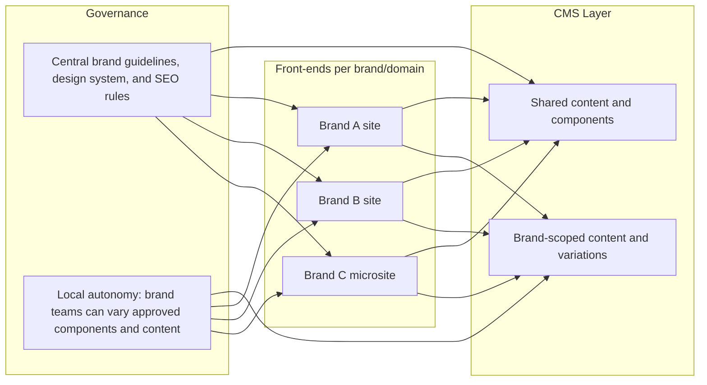

What follows is vendor‑neutral, evidence‑based guidance for mid‑market and enterprise B2B portfolios (multiple brands, BUs, domains, or product lines).

---

## 1) Key architectural patterns

### Pattern overview

Pattern definitions (practical terms)
- Shared content models and components: reusable schemas (e.g., “Product,” “FAQ,” “Hero”) and UI components (e.g., “CTA Card,” “Testimonial Carousel”) that every brand can use but theme/brand. Platforms vary in how “shared” is enforced (see comparison).
- Centralized governance + local autonomy: central teams lock down templates, design tokens, and required fields; brand teams choose among allowed components, create content, and localize within guardrails. AEM’s workflows and permissions are built for this model【turn0search10】, and headless options let you encode similar rules in custom UIs and APIs.
- Multi-domain handling: route each domain (brand or BU) to its own front‑end that queries a shared content API; front‑end configuration maps domains to brand IDs/filters. This is the norm in headless setups and in Drupal’s Domain Access module (one codebase, one DB, multi‑domain)【turn5fetch0】.
- Multi-tenant vs multi-instance: multi-tenant = one CMS instance with brand filters (often a “tenant” field or project/workspace). Multi-instance = separate CMS installs. Headless CMSs and Payload typically favor multi-tenant; WordPress and Drupal support both.

---

## 2) Risks of poor multi-brand CMS architecture

- Content sprawl & duplication: without a single source of truth for common content (e.g., company info, compliance copy), every brand copies/pastes, leading to inconsistencies and higher maintenance. AEM explicitly positions MSM to avoid this【turn9fetch3】.
- Brand drift and compliance gaps: if brands can override the design system or required fields at will, you risk off‑brand colors, copy, or missing disclaimers.
- Cross-brand SEO cannibalization & duplicate content: near‑identical pages across branded sites or subdomains can confuse search engines; Google’s guidance implies duplicates won’t perform well, and best practice is to canonicalize or differentiate meaningfully【turn2search0】.
- Permission leaks: a shared CMS where roles aren’t scoped by brand can let editors of Brand A change Brand B content (or assets). Platforms like Payload address this with tenant‑scoped access controls【turn3fetch3】【turn3fetch4】.
- Release bottlenecks: if all brands share a monolithic release train, a low‑risk microsite can be blocked by another brand’s complex deployment. Well‑architected headless stacks decouple content from front‑end deploys and per‑tenant pipelines.
- Migration pain: overly coupled brands in one instance can make divestitures or rebrands expensive. Loose coupling (per‑brand schemas or “tenant” fields) mitigates this.

---

## 3) CMS comparison for multi-brand use cases

### Summary table

- Ratings: L/M/H (Low/Medium/High) and whether the trait is native or requires custom work.

| Platform | Multi-brand governance | Shared design system | Content model strategy | Multi-domain handling | Brand-specific permissions | Central governance + local autonomy | Reusable components | SEO control across brand sites | One vs multiple instances for multi-brand | Headless/composable fit |
|---|---|---|---|---|---|---|---|---|---|---|
| WordPress Multisite | L–M (network‑admin can control themes/plugins, but brand‑level field/schema constraints need plugins)【turn4fetch0】 | M (global theme/plugin install; per‑site theme activation)【turn4fetch0】 | Shared DB; brands share tables; you can enforce separation via custom post types/capabilities | Native: subdomain, subdirectory, or multi‑domain mapping【turn4fetch0】 | M (network admin vs site admin; user roles can be extended)【turn4fetch0】 | L–M (no built‑in approval workflows or schema enforcement; requires plugins) | M (themes/blocks shared globally; variants per site)【turn4fetch0】 | L–M (SEO plugins work per site; cross‑site canonicals must be managed manually) | Good when brands are similar; if divergence grows, migration to separate installs is common and painful【turn4fetch0】 | M (can run headless via REST/GraphQL, but tooling is bolt‑on; no native visual editing for headless) |
| Drupal | H (granular roles/permissions; can build brand workspaces in UI)【turn5fetch0】 | H (shared themes/components; per‑site theme variants)【turn5fetch0】 | Choose: Multisite (separate DBs), Domain Access (shared DB), or Headless; Domain Access enables shared models & cross‑domain content【turn5fetch0】 | Strong via Domain Access or headless (front‑ends per domain)【turn5fetch0】 | H (fine‑grained per‑domain/node‑type permissions)【turn5fetch0】 | H (Workflows + permissions; Domain Access can enforce brand‑scoped content)【turn5fetch0】 | H (shared components/views/blocks across sites) | H (powerful SEO modules; multi‑domain sitemaps; canonicals per domain)【turn5fetch0】 | Multisite good for similar brands; Domain Access for shared content but different domains; Headless when front‑ends diverge【turn5fetch0】 | H (native JSON:API/GraphQL; mature headless story) |
| Adobe Experience Manager (AEM) | H (permissions, workflows, audit logs; policy‑based authoring; AI governance agents)【turn0search10】【turn2search14】 | H (core components, editable templates, style system; brand themes/policies)【turn0search10】 | H (MSM blueprints and Live Copy inheritance for shared structures; can localize and vary per brand)【turn9fetch1】【turn9fetch2】 | H (MSM rolls out to multiple sites/domains; language‑masters + country‑specific live copies)【turn9fetch1】【turn9fetch3】 | H (per‑site ACLs; regional teams edit their content only, but central controls templates)【turn0search10】 | H (blueprints, rollout configs, approval workflows)【turn9fetch2】【turn9fetch3】 | H (experience fragments and components reusable across brands)【turn9fetch3】 | H (enterprise SEO, multi‑site sitemaps, canonical management) | One instance per region/brand set is typical; MSM is designed to operate within an instance【turn9fetch1】【turn9fetch3】 | H (full headless, hybrid, and edge delivery; supports composable via APIs)【turn2search18】 |
| Contentful | M–H (spaces + environments + roles; governance workflows are maturing; org‑level policies possible)【turn3fetch0】【turn6fetch0】 | L (content model is API‑first; design system lives in front‑end) | M: per‑space models (separate) with cross‑space references; org‑level sharing possible but requires orchestration【turn6fetch0】【turn0search18】 | M (multi‑site is via spaces and front‑ends querying each space; domain routing in front‑end)【turn6fetch0】 | M–H (space‑level roles; enterprise features for approval workflows) | M (no built‑in visual page builder for non‑devs; orchestration layer needed for approvals/brand rules) | M–H (content reuse is strong; component reuse lives in front‑end code)【turn3fetch0】 | H (structured content + metadata + routing in front‑end supports SEO well) | Multi‑space (separate brands) is typical; cross‑space reuse needs design【turn6fetch0】 | Very high: composable by design; multi‑brand via org > spaces > environments |
| Sanity | M–H (multi‑tenancy is customizable; permissions scoped per dataset/market; cross‑dataset references)【turn8find3】 | L (design system in front‑end) | M–H: multi‑project or multi‑dataset; cross‑dataset references enable shared content; schema can vary per workspace【turn8find3】 | M (domain routing in front‑end; queries scoped to datasets/brands) | M–H (roles scoped to datasets/document types; per‑market scopes)【turn8find3】 | M (highly customizable Studio UI can encode brand‑specific workflows) | M (shared schemas; front‑end components shared via code) | H (structured content + routing; schema can include SEO fields) | One project with multiple datasets/workspaces, or separate projects per brand when teams are fully separate【turn8find3】 | Very high: composable; datasets/workspaces and cross‑dataset references give flexibility |
| Storyblok | M–H (multi‑tenant via Spaces: each space is a repo with its own components, assets, domains, collaborators, permissions)【turn3fetch2】 | M (components and assets live per space; reuse across spaces via component sync/pipelines)【turn1search5】 | M: per‑space models; multi‑space pipelines and component sharing can enforce consistency【turn1search5】 | M (domains configured per space; front‑end can aggregate if needed)【turn3fetch2】 | M–H (per‑space collaborators/roles; Enterprise plans for advanced governance)【turn3fetch2】 | M (visual editor + multi‑space pipelines help central control and local staging)【turn1search5】 | M–H (component sync between spaces)【turn1search5】 | H (visual editor + SEO fields; routing in front‑end) | Typically multi‑space under one account; can be treated as one instance with logical separation【turn3fetch2】 | High: headless/visual; multi‑space management targets this use case【turn3fetch2】【turn3fetch1】 |
| Payload CMS | M–H (multi‑tenant plugin; tenant selector in Admin; filters and access controls per tenant)【turn3fetch3】【turn3fetch4】 | L (design system in front‑end) | M–H (tenant field on collections; global‑like collections for shared content; RBAC)【turn3fetch3】 | H (single codebase, multi‑domain front‑ends; admin adapts per tenant)【turn3fetch4】 | H (tenant‑scoped access; super admins see all; users scoped to tenant IDs)【turn3fetch4】 | M (code‑first; you can build custom workflows, but less out‑of‑the‑box UI than AEM) | M (shared schemas/collections; front‑end components are code) | H (SEO plugin; structured content)【turn3fetch3】 | One instance with multi‑tenant plugin is the recommended pattern【turn3fetch3】【turn3fetch4】 | Very high: self‑hosted headless; multi‑tenant plugin explicitly for this |
| Webflow | M (Enterprise: advanced roles, approvals, Shared Libraries, multi‑site in one workspace; but no native API‑first content model)【turn3fetch5】【turn3fetch6】 | H (Shared Libraries synchronize components across sites)【turn3fetch5】【turn3fetch6】 | L–M (CMS collections per site; sharing content across sites needs APIs or manual processes)【turn3fetch6】 | M (site cloning + staging domains per site; composable patterns via APIs feeding Webflow Collections)【turn3fetch6】 | H (custom roles; per‑page/collection scoping)【turn3fetch5】 | M (branching/approvals; Shared Libraries for design governance)【turn3fetch5】 | H (Shared Libraries with auto‑propagation)【turn3fetch6】 | H (built‑in SEO tools per site; cross‑site canonicals are manual) | One Enterprise workspace with unlimited sites; component sharing via Shared Libraries【turn3fetch5】【turn3fetch6】 | M–H (strong for marketing sites; for composable/apps, Webflow often becomes presentation layer fed by external CMS)【turn3fetch6】 |

---

## 4) Practical recommendations for mid‑market B2B companies

### When to use one CMS instance vs multiple instances

Use one instance (multi‑tenant or multi‑site) when:
- High overlap in content types across brands (e.g., “Products,” “Case Studies,” “Team Members”).
- You want shared components and a unified design system with localized theming.
- Compliance/audit benefits from one permissions model and one update train (security patches applied once).
- You’re comfortable investing in governance tooling/workflows once.

Consider multiple instances when:
- Brands have very different content models, release cadences, or regulatory regimes.
- Divestiture or M&A is likely; loose coupling reduces migration pain.
- You need different vendor/hosting stacks per brand.
- Your teams are fully separate with conflicting roadmap priorities.

For most mid‑market B2B portfolios, a single, well‑governed instance (or one per major region) is preferable if you implement clear tenant/brand separation and reusable schemas【turn5fetch0】【turn3fetch4】.

### Shared vs separate content models

- Share by default for operational content: global legal pages, careers, investor relations, “About,” and product data models that all brands use. Use “global” or shared collections/datasets to avoid duplicates【turn8find3】【turn3fetch3】.
- Separate when brands genuinely differ: distinct product lines, verticals, or audience segments that require bespoke fields and validation.
- Implementation tips:
  - Tag or tenant‑field shared collections so queries can filter by brand.
  - Use cross‑dataset/project references (e.g., Sanity cross‑dataset references, Contentful cross‑space references) to avoid copying shared content【turn8find3】【turn6fetch0】.
  - Enforce required fields and validation centrally to prevent brands from drifting on critical data.

### Design system sharing

- If your CMS is headless (Contentful, Sanity, Storyblok, Payload), keep the design system in code (e.g., a component library) and pass brand tokens/variants from the CMS or front‑end config. Contentful and Sanity focus on content structure; design consistency is a front‑end concern【turn6fetch0】【turn7fetch0】.
- If you’re using a coupled CMS:
  - AEM: use editable templates, policies, and core components for brand variants【turn9fetch1】【turn9fetch3】.
  - Drupal: share themes and components; override per brand/site.
  - Webflow Enterprise: use Shared Libraries to push consistent components across sites【turn3fetch5】【turn3fetch6】.
  - WordPress Multisite: enforce a base theme and limit which themes each site can activate【turn4fetch0】.

### Multi-domain management

- Prefer subdirectories (brand.com/productA) when brands are closely related and you want domain authority to accumulate; search engines often treat subfolders as part of the main site【turn2search9】.
- Use subdomains or separate domains when brands are distinct enough to warrant separate identities or legal separation; but expect each to build its own authority and avoid duplicating core content across them【turn2search9】【turn2search8】.
- In headless stacks, implement a domain‑to‑tenant map in your front‑end or edge function so the same API serves multiple brands from one backend (Payload documents this pattern explicitly)【turn3fetch4】.

### SEO risk mitigation across multiple brand sites

- Avoid large‑scale duplicate text across domains/subdomains. Where duplication is necessary, use canonicals and, if appropriate, noindex on the derivative versions【turn2search0】【turn2search3】.
- Maintain unique, value‑added content per brand (localization, use cases, customer evidence) rather than near‑identical pages.
- Centralize sitemaps, robots.txt, and hreflang configuration per brand; with a single CMS you can generate these from a unified schema.
- Track indexation and rankings per domain/brand; coupled platforms (Drupal, AEM) have strong SEO tooling; headless options require you to implement SEO fields and rendering in the front‑end.

### Governance and permissions

- Define roles centrally and map them to brands: Super Admin, Brand Admin, Editor, Contributor. Ensure the CMS can scope these to a brand/tenant (AEM, Drupal, Payload, Storyblok do this well)【turn0search10】【turn5fetch0】【turn3fetch3】.
- Use approval workflows for high‑risk content (legal, pricing, compliance). AEM has this natively; others need custom configuration or integrations【turn0search10】.
- Audit regularly: ensure editors can’t access or edit content outside their brand. Leverage tenant‑scoped access logs and change logs【turn0search10】【turn3fetch4】.

### How headless/custom CMS architectures support multi-brand setups

- Decoupling content from presentation lets multiple front‑ends (one per brand/domain) consume shared content via APIs, while applying brand‑specific styling and routing. Examples: Contentful spaces, Sanity datasets, Payload multi‑tenant【turn6fetch0】【turn8find3】【turn3fetch4】.
- You can evolve or replace front‑ends per brand without touching shared content models.
- The trade‑off: you must build governance (approvals, brand‑scoped roles, previews) into your custom UI or Studio configuration, which is more engineering work than AEM/Drupal out‑of‑the‑box【turn7fetch0】【turn6fetch0】.
- For B2B mid‑market, a pragmatic composable stack often looks like: a headless CMS with multi‑tenant support (Contentful, Sanity, Storyblok, or Payload) + one or more front‑ends + a lightweight design‑system package.

### Platform shortcuts by scenario

- Strongly coupled brands with strict brand control and enterprise budget → AEM (MSM, workflows, permissions) or Drupal (Domain Access/headless)【turn9fetch1】【turn5fetch0】.
- Multiple brands with shared content but different front‑ends → Contentful or Sanity, with careful space/dataset design and cross‑references【turn6fetch0】【turn8find3】.
- Developer‑led, cost‑sensitive multi‑brand portfolio → Payload (self‑hosted, multi‑tenant plugin) or Storyblok (multi‑space, visual editor)【turn3fetch3】【turn3fetch2】.
- Marketing‑led, design‑heavy brand sites → Webflow Enterprise (Shared Libraries, multi‑site workspace)【turn3fetch5】【turn3fetch6】.
- Incremental shift from WordPress → WordPress Multisite works if brands are similar and governance needs are modest; consider headless on top if you need multi‑channel delivery【turn4fetch0】.

If you share your current mix of brands, domains, and tech stack, I can map this to a concrete target architecture (including per‑brand content model outline, domain structure, and a short migration path).