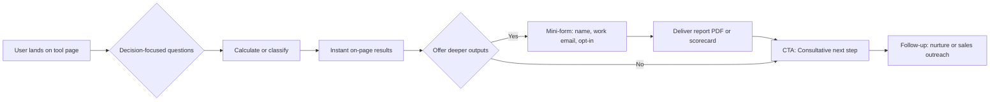

Here’s the synthesis across research and live B2B examples.

## 1) Why interactive tools work in B2B (and how they support decisions)

- Buyers prefer active experiences. In one benchmark, 91% of B2B buyers said they prefer visual/interactive content over traditional static formats. Interactive content also drives higher engagement; one analysis found brands using interactive content saw a 94% increase in content views vs. static-only peers【turn10find0】【turn17fetch0】.
- They move buyers from “reading” to “reasoning.” A calculator/decision tree makes assumptions explicit and lets people tweak inputs. This shifts the tool from marketing fluff to decision-support, which executives actually value. CMI’s research notes marketers use interactive content primarily for engagement, education, awareness, and lead generation【turn5find1】.
- They generate high‑signal lead data. Every input is behavioral + firmographic/intent data you can use to score and route leads. Demand Gen Report documents how Lattice Engines bundled a buyer’s guide with an interactive decision‑making checklist; that mix influenced 20+ opportunities and 200+ guide downloads【turn10find0】.
- They unblock buying groups. By producing a shareable output (PDF, scorecard), tools give the champion a “leave‑behind” for internal meetings, which is a key job‑to‑be‑done for B2B buyers.

## 2) Best practices for building and deploying interactive tools

### a) Start from the decision, not the gimmick

- Anchor each tool to a concrete decision: “Should we migrate now?” “Which CMS shortlist?” “What’s the likely ROI of a redesign?” “Which migration risks are our top 3?”
- Use the same decision‑tree logic for all your tools (see the flow below). This makes outputs consistent and easier to productize.

### b) UX & design: clarity and credibility

- Don’t gate before value. NN/G’s research on calculators is blunt: “Do not force users to register to use a tool.” Let people see results first; ask for info only when they want to save/email a report【turn6fetch0】【turn7find0】.
- Keep inputs short and essential. NN/G recommends making only essential inputs required, and mixing sliders/dropdowns (for approximate values) with open text (when precision matters)【turn6fetch0】.
- Explain what you’re asking and why. Offer tooltips or short explanations next to inputs; consider briefly exposing the calculation logic to build trust【turn6fetch0】【turn7find2】.
- Avoid misleading defaults. Set conservative defaults and label units clearly; bad defaults destroy credibility instantly (NN/G has a mortgage example where inaccurate property‑tax defaults skewed results)【turn7find1】.
- Make it interactive and easy to iterate. Allow easy “reset,” “undo,” or inline sliders so users can run scenarios. Let them toggle inputs and see outputs change in real time【turn6fetch0】.
- Embed on context pages where possible. Users prefer embedded tools on relevant pages rather than standalone pop‑ups; just ensure fast load times【turn6fetch0】.
- Optimize for SEO. Include terms like “calculator,” “assessment,” “decision tool,” and the target job (“website redesign cost calculator”) in the title, H1, and meta description so buyers find it from search【turn6fetch0】.

### c) Structuring outputs (what users actually see)

Design outputs so a non‑technical executive can skim and still find the “so what.”

- One‑page summary template (apply to most tool types)
  - Headline: e.g., “Your website redesign: estimated cost, risk profile, and ROI scenario”
  - Input snapshot: 3–5 bullets of what they entered (e.g., pages, languages, integrations, current stack) to ground the outputs.
  - Primary KPI(s): a range or score (cost range, risk score 1–100, ROI payback period).
  - Scenario comparison: a simple table (Base vs. Optimized vs. Best‑case) with 3–5 metrics; Oracle’s Marketing Automation ROI Calculator does this with funnel metrics and benchmarks to show “current vs. optimized” outcomes【turn11fetch0】.
  - Prioritized risks or “top 3 actions”: e.g., migration risks with severity, or a short “do next” checklist.
  - Assumptions and sources: list key assumptions and, if possible, link to benchmarks or an explainer. NN/G notes that showing the logic can boost trust【turn7find2】.

- Tool‑specific output guidance
  - Website redesign cost calculator: show a cost range (low/mid/high) with line items (design, content, integrations, QA, ongoing TCO). Include a timeline view and a simple payback formula if ROI is possible.
  - CMS selection tool: present a shortlist (2–4 options) with alignment scores, plus a heat map of “fit by capability.” Include a “next step” checklist for each vendor (e.g., security, GDPR, API).
  - Migration risk assessment: show a risk heat map by category (data, SEO, integrations, performance, compliance), with recommended mitigations. Deloitte’s VERA risk dashboard is a good model: it provides a dynamic view of risks and lets leaders filter by business unit and region【turn13find0】.
  - Website audit tool: group findings by impact (Revenue/Safety/Performance) and quick wins vs. strategic items. Include an effort/impact matrix.
  - Cost/ROI estimators: anchor to business outcomes (pipeline lift, time saved, cost avoided). Salesforce’s Agentforce ROI Calculator ties use cases (SDR, service, etc.) to estimated consumption and benefits, which is then used to justify investment【turn20fetch0】.
  - Interactive decision trees: present a clear recommended path and the rationale; display “if X, then Y” logic concisely and allow users to revisit branches.

### d) What to ask for (and when) to generate qualified leads

- Tier your asks (progressive profiling):
  - Before results: no form (or just an optional “save my results” email) to maximize completion.
  - To unlock the report/scorecard: minimal fields: first name, work email, company, and one qualifying question (e.g., “Which CMS are you on today?” or “When do you plan to migrate?”).
  - Inside the report (optional): role, team size, or phone number (label why you need it).

- Always prioritize “work email” and “company” to reduce junk leads. Form best‑practice research shows keeping fields short and using clear labels increases completions and data quality【turn3search4】.

- Use conditional fields to keep it relevant. If they select “Enterprise” size, optionally ask about regions; if “SMB,” skip it. This improves UX and signal quality【turn3search4】.

### e) Avoid gimmicks: keep it serious and valuable

- Tone down “gamification.” Remove points, badges, and playful animations for executive audiences. Instead, frame the tool as a “tool for your job” (e.g., “Build the business case for the board”).
- Base everything on real benchmarks. Cite sources on the page and in the report (e.g., industry averages, your own anonymized data). Oracle’s calculator shows funnel benchmarks with sources (SiriusDecisions) to legitimize the model【turn11fetch0】.
- Make inputs optional where possible. Let users skip an input or use a “I don’t know” default rather than forcing a number. NN/G calls out that users expect better accuracy with more inputs, but will bail if forced; they recommend making only essential inputs required【turn6fetch0】.
- Test with real buyers. Run usability tests; watch where they pause, doubt a number, or abandon. Adjust labels, defaults, and helper text accordingly.

### f) Connect tools to consultative offers

- “End” the tool with a natural, low‑commitment CTA, not a hard sell:
  - “Get a 30‑minute working session to pressure‑test these numbers with an expert.”
  - “Request a custom migration risk workshop for your stack.”
  - “Book a short call to align this scorecard with your RFP criteria.”
- Offer choices: “Download PDF,” “Email this report,” “Schedule a call,” or “Explore vendor comparison matrix.” Evidence on CTAs shows simple, clear, and stage‑appropriate wording increases clicks【turn3search14】【turn3search17】.
- Make the tool part of a larger narrative. Lattice Engines paired a buyer’s guide with an interactive checklist; the checklist didn’t replace the guide—it made it actionable, which drove real pipeline【turn10find0】. Replicate this by integrating tools into your CMS decision report (see section 3).

## 3) Examples from credible B2B companies

- Salesforce – Agentforce ROI Calculator. Lets users select AI use cases and then see estimated impacts and required resources, connecting directly to next steps like demos or professional services【turn20fetch0】.
- Oracle – Marketing Automation ROI Calculator. Walks users through a funnel model (Suspect → Inquiry → MQL → SAL → SQL → Closed), pre‑populates industry benchmarks (sourced to SiriusDecisions), and lets them compare current vs. optimized scenarios—then offers a “Download Results” CTA【turn11fetch0】.
- Deloitte – Virtual Enterprise Risk Assessment (VERA) Tool. A customized risk dashboard for virtual working. It provides a dynamic, filterable view of risks by unit/region and is co‑created with clients via workshops—then delivered as a tailored, consultative asset【turn13find0】.
- HubSpot, Intercom, Outreach, and others – ROI calculators. A curated list shows major SaaS brands deploying calculators to help buyers quantify value during evaluation【turn8fetch0】.
- Deloitte (interactive content) – Financial Services Regulatory Timeline Tool. Lets users filter regulatory events by theme and industry, making a complex landscape explorable and less intimidating【turn19find0】.
- Control Risks – Interactive RiskMap. Uses hoverable maps to show per‑country risk ratings, enabling quick risk screening and opportunity identification for clients【turn19find1】.
- WebFX – Website cost calculator. Embedded in a “how much does a website cost” article; lets users calculate an approximate cost based on specs and is paired with a “get a free estimate” CTA【turn16find0】.

## 4) Recommendations for using these tools in a CMS decision report

When you’re building a CMS decision report for stakeholders, tools should be embedded as practical “do it with me” elements, not side attractions.

- Where to embed which tools
  - Early in the report: CMS selection decision tree (short). Use 4–6 questions to narrow the field; then show a recommended shortlist with alignment scores.
  - Mid‑report: migration risk assessment. Let users choose their current stack, target CMS, and complexity factors (number of templates, languages, integrations). Output a risk heat map with mitigations.
  - Later in the report: website redesign cost calculator and ROI estimator. Allow users to set scale and ambition and then see cost vs. ROI scenarios; tie this directly to the vendor/implementation partner discussion.
  - Throughout: optional mini website audit “health check” sidebar that can be expanded and saved as a one‑page scorecard.

- How to narrate the tools
  - In the text, explicitly call out: “Use the tool above to populate the cost/risk section for your context.” This makes the report a working document, not a PDF to be ignored.
  - Include a “How to use this report” section that maps each tool to a stakeholder job (CFO cares about cost/ROI; CIO/IT cares about migration risk; Marketing cares about CMS fit).

- Outputs become report appendices
  - Auto‑generate a two‑page executive appendix with:
    - Shortlist table (CMS selection).
    - Risk heat map and mitigations (migration risk).
    - Cost range and ROI payback graph (cost/ROI tools).
  - This gives the champion a ready‑made slide deck for the buying committee, increasing the chance that the tool actually influences the decision.

- Data privacy and governance
  - Keep the CMS tool deployment within your own or a reputable vendor’s environment. Clearly state what data is stored, and for how long.
  - For sensitive industries, provide a “fully on‑prem/self‑hosted” option or at least an offline Excel version that mirrors the web tool.

## 5) Suggested CTA structure for each tool

Use a consistent, stage‑aware CTA pattern that feels consultative. Here’s a reusable blueprint.

- Primary CTA (post‑results, to unlock report)
  - Label: “Get your custom scorecard (PDF).”
  - Fields (shown only here): First name, Work email, Company, Role (optional), One qualifier (e.g., “Current CMS?”).
  - Microcopy: “We’ll email your personalized report and suggestions. No spam—unsubscribe anytime.”

- Secondary CTAs (visible on results page, not gated)
  - “Ask an expert a quick question” → opens a short form with a text box.
  - “Schedule a 30‑minute working session” → calendar link or form (date/time preference).
  - “Explore vendor comparison matrix” → lands on another interactive page or PDF.

- Tertiary CTAs (in the report/PDF or follow‑up email)
  - “Request a tailored migration risk workshop for your team.”
  - “Get help drafting the RFP with these criteria pre‑filled.”
  - “Share this tool with a colleague” (link to an email template or a shareable URL).

- CTA copy tips
  - Be specific and outcome‑oriented: “Get your custom risk heat map and mitigation plan” beats “Learn more.” CTA best‑practice research emphasizes clear, concise, and stage‑appropriate wording to drive clicks【turn3search14】【turn3search17】.
  - Show the next step: “Book a 30‑minute session to pressure‑test these numbers with our team.”
  - Add trust signals next to the CTA: “Usually responds within one business day,” or a link to privacy policy.

Putting it together: the most effective B2B programs treat these tools not as one‑off marketing widgets, but as reusable decision‑support “engines” embedded into buyer‑enabling assets (like a CMS decision report). Keep inputs minimal but meaningful, outputs contextual and credible, and CTAs firmly consultative—then measure completion, report downloads, and downstream pipeline influenced by tool users.