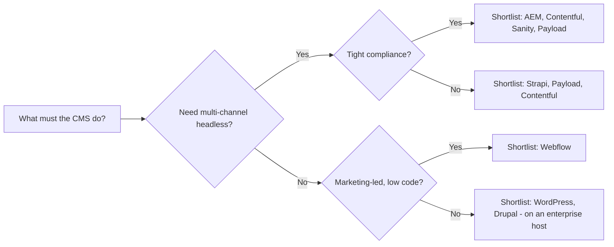

Below is a structured view of CMS security and governance for mid‑market B2B in 2026, with a focus on your areas of concern.

## 1) Key security/governance requirements (mid‑market B2B)

These are the non‑negotiable controls your CMS platform and processes must deliver.

- Roles and permissions (RBAC and ABAC)
  - Least‑privilege roles tied to job functions (content editor, reviewer, publisher, admin, dev). For self‑hosted stacks, implement field‑ and operation‑level access (e.g., Payload’s collection/global/field access controls).【turn6fetch7】
  - Ability to restrict who can change what: content types, schemas, code/config, SEO settings, integrations, and permissions themselves.
  - Strong separation of “can author” vs “can publish” vs “can change permissions or infrastructure.”

- Access control
  - Centralized identity via SSO (SAML/OIDC) with MFA; provisioning/deprovisioning automated (IdP→CMS). Many vendors provide SSO (Contentful, Sanity, Webflow, AEM, Payload).【turn3search11】【turn1search7】【turn3search0】【turn4search0】【turn6fetch8】
  - Restrict admin access to the smallest viable group and enforce session policies.
  - API tokens/keys managed centrally, with short TTLs, scope limitation, and audit (Contentful tightened token management/expiry in 2026; same pattern should apply to any CMS).【turn9fetch1】

- Approval workflows and publishing governance
  - Mandatory “request review → approve → publish” pipelines with clear states (Draft → Ready for Review → Approved → Scheduled → Published) and with one accountable final approver per item.【turn5search3】
  - Restrict direct publishing to production to specific roles; gate both page and content‑type/schema changes (avoid “rogue publishing”).【turn4search12】
  - For decoupled/headless, treat schema changes as code and require PRs/reviews before merging to production environments.

- Audit trails
  - Immutable, exportable logs that answer “who did what, when, and on which environment/record.” Contentful delivers audit logs to customer‑controlled storage (GCS/Azure/AWS) with rich event detail.【turn9fetch0】 Webflow Enterprise offers an audit log API with 1‑year retention.【turn6fetch6】
  - Include user, IP, method/path, entity IDs, and old/new values where feasible; integrate with SIEM. AEM maintains audit logs (with retention/cleanup considerations).【turn4search2】【turn4search7】

- SSO and session hygiene
  - SSO enforced org‑wide, no local password fallbacks, with IdP‑driven deprovisioning. Contentful in 2026 removed automatic SSO exemptions for owners and added MFA for exceptions to close gaps.【turn9fetch1】
  - Session timeouts, re‑auth for sensitive actions, and forced logout on IdP session revocation.

- Environment separation
  - Distinct dev/stage/prod environments; content workflows and code change pipelines flow through non‑prod first. Many headless platforms support “environments” and aliases for promotion.【turn9fetch0】
  - For self‑hosted, enforce read‑only production filesystems and deploy via CI/CD (e.g., enterprise WordPress guidance emphasizes immutable filesystems and automated pipelines).【turn8find3】【turn8find1】
  - Staging environment for content previews and QA, with role‑based controls (e.g., Webflow supports private staging and page branching; Webflow docs link staging/publishing workflows).【turn6fetch6】

- Plugin/dependency risk
  - Minimal, audited plugin surface; prefer native features or first‑party integrations.
  - Dependency scanning in CI (SBOM/npm audit/etc.); update cadence aligned to your risk tolerance. Self‑hosted platforms like WordPress/Drupal/Strapi require discipline here, with regular patching (OWASP emphasizes dependency‑level risks).【turn0search0】【turn0search3】
  - For SaaS/headless, review vendor marketplace security (e.g., Contentful apps/extensions).【turn6fetch3】

- Responsibility boundaries (self‑hosted vs SaaS)
  - Self‑hosted (WordPress/Drupal/Strapi/Payload on your infra): You own OS, runtime, WAF, backups, patching, and network segmentation.
  - SaaS/PaaS (Webflow, Contentful, Sanity, AEM as a Cloud Service, Strapi Cloud, Payload Cloud): Vendor secures the platform and infra, and typically provides compliance certifications. You secure access, integrations, and your front‑end (Webflow: SOC 2 Type 2 & ISO 27001; Contentful: ISO 27001 & SOC 2 Type 2; Sanity: SOC 2 Type II & ISO 27001; AEM: listed under Adobe compliance with standards like SOC 2, ISO 27001, FedRAMP, HIPAA).【turn6fetch5】【turn6fetch3】【turn6fetch4】【turn11fetch0】【turn0search16】
  - Hybrid (AEM Managed Services, self‑hosted headless with a managed DB): Shared responsibilities must be spelled out in your DPA.

- Data ownership
  - Exportable content and assets at all times, in open/standard formats. Prefer no vendor lock‑in to schema definitions.
  - Contractual clarity: right to export, delete, and port; clarity on sub‑processors and locations.
  - If using AI features (Contentful AI Actions, AEM GenStudio), understand training/retention policies and opt‑outs.【turn9fetch1】

- Compliance
  - Map obligations (GDPR, CCPA, DORA, sectoral rules) to CMS controls: data residency, encryption, retention, consent, DSAR handling, and auditability. AEM provides GDPR readiness guidance and data‑protection documentation for privacy requests.【turn4search14】【turn4search15】【turn4search16】
  - Ensure certifications and DPAs align: Adobe lists SOC 2, ISO 27001, HIPAA, FedRAMP for AEM; Webflow lists SOC 2, ISO 27001/27017/27018, PCI DSS, GDPR, CCPA, DORA; Contentful and Sanity document ISO 27001 and SOC 2 (or Type II).【turn11fetch0】【turn6fetch5】【turn6fetch3】【turn6fetch4】
  - Cookie/consent and data minimization: AEM has specific guidance on classifying cookies and respecting consent for analytics/personalization tags; apply the same discipline on any platform.【turn6fetch2】

- Who can change what (schema, config, code, settings)
  - Content types/schemas, roles/permissions, and integrations should require a change request, review, and approval (ideally code review for schema/config-as-code).
  - Use separate “admin” vs “editor” interfaces where possible; hide destructive operations from content roles. Payload, for example, dynamically hides collections in the admin UI based on access control, aligning UI with API security.【turn6fetch7】

---

## 2) Common CMS security risks (2026)

These are the threats you should explicitly mitigate, regardless of platform.

- Broken access control
  - Over‑privileged roles (e.g., editors who can also change schemas or install plugins) and default passwords.
  - Mitigation: enforce RBAC/ABAC with regular access reviews; centralize IdP and enforce MFA.【turn0search0】

- Plugin and dependency exploits
  - Malicious or unmaintained plugins/packages and supply‑chain attacks on npm/composer.
  - Mitigation: minimize plugins, scan dependencies, auto‑update critical patches, and maintain an allowlist. Strapi has disclosed multiple critical CVEs; keep it updated.【turn1search17】【turn1search19】

- Authentication/session failures
  - No SSO, weak password policies, and long‑lived sessions. Phishing and credential stuffing remain prevalent.
  - Mitigation: SSO + MFA, session timeouts, and conditional access policies.

- Incomplete audit coverage
  - Missing logs for permission changes, content deletions, or API key rotations; short retention; logs only in the vendor UI.
  - Mitigation: integrate audit logs to your SIEM with long retention and tamper‑evident storage (e.g., Contentful supports exporting to AWS/GCS/Azure).【turn9fetch0】【turn6fetch6】

- Weak environment separation
  - Editors accidentally publishing to prod; schema changes hitting prod without review.
  - Mitigation: separate environments; enforce pipelines; restrict production write access to CI and specific roles. Use staging/previews for review.【turn5search0】【turn6fetch6】

- Content approval risk
  - Bypassing approval workflows; publishing without legal/compliance review; lack of version diffs and rollback.
  - Mitigation: enforce workflows; require approvals before publishing; maintain version history with diff capabilities (Drupal’s Content Moderation + Diff; AEM workflows).【turn2search10】【turn4search12】

- Misconfigured integrations and webhooks
  - Webhooks with no auth, or third‑party apps with overly broad tokens.
  - Mitigation: sign webhooks (HMAC), scope tokens narrowly, and monitor for unexpected writes.

- Vendor/platform outages and data residency surprises
  - Reliance on shared infra or CDNs; unclear data locations.
  - Mitigation: choose vendors with transparent status pages, published SLAs, and clear data‑region options (Webflow and Sanity post status pages and detail infrastructure/hosting locations).【turn1search6】【turn6fetch5】

---

## 3) CMS category comparison (security/governance tradeoffs)

### At a glance

- Type definitions
  - Traditional coupled: WordPress, Drupal, AEM
  - Headless/API‑first: Contentful, Sanity, Strapi, Payload
  - Visual/site‑builder SaaS: Webflow

Summary table (controls typical for a B2B deployment at scale):

| Control | WordPress | Drupal | AEM | Contentful | Sanity | Webflow | Strapi | Payload CMS |
|---|---|---|---|---|---|---|---|---|
| Roles/permissions | Coarse RBAC by default; can tighten with plugins + hosting platform policies. Needs care to avoid over‑privilege. | Fine‑grained RBAC; per‑content‑type perms; robust Content Moderation module for workflows. | Granular ACLs per page/asset; supports workflows and permissions mapping to groups; enterprise‑grade. | Two‑tier model: org roles + space roles; env‑level perms improved in 2026. | RBAC, per‑dataset visibility, env‑scoped access (Enterprise). | Workspace + site roles; “Can publish” toggle; design vs edit vs review split. | RBAC in admin; API perms configurable per route/collection; requires rigor to lock down. | Code‑defined, field‑level access; admin UI mirrors API security; strong isolation by design. |
| Approval workflows | Via plugins (e.g., PublishPress) or hosting features (Pantheon Content Publisher). Not core. | Core Workflows + Content Moderation (Draft → Review → Published) per content type. | Robust OOTB workflows for review/publish/delete; can model custom workflows. | Use environments & CI; native automations; workflow patterns in docs. | “Content Releases” feature for batch publish; workflows via custom mutations/webhooks. | “Publishing workflow” + “Design approvals”; per‑role “Can publish”; page branching. | Core “Draft/Published” states; workflow extensions exist but less prescriptive. | Enterprise “Publishing Workflows” with code‑defined states and roles. |
| Audit trails | Via plugins (e.g., WP Security Audit Log) + hosting platform logs. Quality varies. | Core activity logs can be extended; contributed modules for audit logging. | Audit log exists but has retention/cleanup considerations; user‑mgmt events may need separate logs. | Native audit logs with delivery to AWS/GCS/Azure; rich events and AI enrichment. | Enterprise audit logs and change history across environments. | Enterprise: Workspace audit log API (1‑year retention) and Site Activity log. | Core/audit log plugin ecosystem; Strapi has an audit log feature for API actions. | Enterprise audit logs (compliance‑focused) with visibility into changes. |
| SSO | Via SAML/OIDC plugins; enterprise hosts add platform‑level SSO + audit trails. | SAML/OAuth via modules; widely used in enterprise hosts (Acquia, Pantheon). | SAML handler for AEM 6.5; IMS/SAML support for AEM Cloud Service author environments. | SAML SSO with predefined IdP integrations; SCIM for provisioning; strict SSO enforcement in 2026. | SAML SSO via Enterprise plan; IdP group → role mapping. | SSO via Enterprise (SAML/OAuth) with SCIM/JIT (multi‑domain, multi‑workspace). | Via plugins/modules; not native in CE; Enterprise may add features. | Enterprise SSO (SAML/OAuth) with IdP integration and field‑based access mapping. |
| Environment separation | Provided by managed hosts (dev/test/live, Multidev). Self‑hosted must replicate. | Supported by enterprise platforms (Acquia/Pantheon) with dev/stage/prod. | Author/Publish separation; environments in AEM Cloud Service; Cloud Manager pipelines. | Environments per space; promote via aliases/CI; env‑level perms. | Datasets and environments; Content Releases for batch promotions. | Staging domains and “Private staging,” page branching, publishing workflow. | Manual env setup typically; tooling varies by host. | You control environments (infrastructure‑level); can enforce via CI and infra‑as‑code. |
| Plugin/dependency risk | Very high plugin surface; supply‑chain risk if not curated. Enterprise hosts mitigate with immutable filesystems and WAF. | Smaller ecosystem than WP; strong security team and advisories; still watch contrib modules. | Large extension marketplace; Adobe vets but customer bears implementation risk. | Marketplace apps; vendor curates, but you must vet third‑party apps. | Plugin ecosystem; vendor encourages vetting and provides a security contact. | No plugins; limited extensibility via apps/integrations; strong platform control. | Plugin ecosystem; CVE history exists; patching discipline critical. | Plugin system; you control scope; fewer third‑party plugins in practice. |
| Self‑hosting responsibility | You own infra, WAF, backups, patching; hosting platform can offload much. | Similar to WP but with strong core security; needs OS/infra hardening. | For on‑prem/managed: you share responsibility for configs, custom code, and networking. | SaaS only: vendor manages infra; you manage access and integrations. | SaaS only (or Managed): vendor manages infra; optional self‑hosted Studio UI only. | SaaS only; vendor manages infra and hosting. | You own infra if self‑hosting; Strapi Cloud offloads infra. | You own infra if self‑hosting; Payload Cloud is available. |
| SaaS vendor security responsibility | N/A for core; hosts may provide SOC 2, WAF, SSO. | Same as WP; enterprise hosts provide attestations. | Adobe Trust Center: SOC 2, ISO 27001, HIPAA, FedRAMP, GDPR, CCPA, etc. | ISO 27001, SOC 2 Type 2; audit log delivery; GDPR/privacy measures. | SOC 2 Type II and ISO 27001; GDPR‑compliant; DXP scorecard confirms clean track record. | SOC 2 Type 2, ISO 27001/27017/27018, PCI DSS, GDPR, CCPA, DORA. | Strapi Cloud shares security responsibilities; CE is fully on you. | Payload Cloud shares responsibility; self‑host is fully on you. |
| Data ownership | Full; files and DB on your infra; easy export. | Full; DB/files under your control. | DPA governs ownership; Adobe provides privacy request tooling (AEM). | You own content; exportable via API/UI; vendor stores and delivers it. | You own content; APIs and tooling to export; cloud‑hosted Content Lake. | You own content; export tools exist; less flexible due to coupled hosting. | Full if self‑hosting; Strapi Cloud: check DPA. | Full if self‑hosting; Payload Cloud: check DPA. |
| Compliance readiness | Host‑dependent (SOC 2 hosts help). Requires configuration. | Host‑dependent; core strong, but you must configure and document. | Strong: Adobe publishes compliance list (SOC 2, ISO 27001, HIPAA, FedRAMP, etc.). | Strong: ISO 27001 and SOC 2 Type 2; GDPR focus; audit logs for regulators. | Strong: SOC 2 Type II and ISO 27001; GDPR and data‑residency options. | Strong: SOC 2 Type 2, ISO 27001/27017/27018, PCI DSS, GDPR, CCPA, DORA. | CE: on you; Cloud: Strapi should provide DPA/attestations. | Self‑host: on you; Cloud: check Payload’s DPA/attestations. |

### Category notes

- WordPress
  - Strengths: huge talent pool, rich plugins, and enterprise hosts now offer provable governance controls like immutable filesystems, SSO, and audit trails.【turn8find3】【turn8find1】
  - Tradeoffs: core RBAC is coarse; workflows/audit rely on plugins or host features; plugin surface is large, so you must curate and patch aggressively.

- Drupal
  - Strengths: mature RBAC and core Content Moderation workflows (Draft/Archived/Published) with per‑type configuration; active security advisories and hardening guides.【turn2search10】【turn0search11】【turn0search13】
  - Tradeoffs: steeper learning curve; fewer “plug‑and‑play” integrations than WP; self‑hosting requires serious DevOps discipline.

- AEM
  - Strengths: built‑in workflows, page‑tree permissions, and SAML/IMS integration; Adobe Trust Center lists extensive certifications (SOC 2, ISO 27001, HIPAA, FedRAMP, GDPR/CCPA); robust privacy request tooling for AEM Cloud Service.【turn11fetch0】【turn4search0】【turn4search5】【turn4search14】【turn4search15】【turn4search16】
  - Tradeoffs: cost and complexity; governance is powerful but must be configured carefully; audit log retention and user‑management events need attention.

- Contentful
  - Strengths: ISO 27001 & SOC 2 Type 2; strong IAM with strict SSO enforcement and SCIM; env‑level permissions; rich audit logs delivered to your storage; compliance posture is well‑documented.【turn6fetch3】【turn9fetch1】【turn9fetch0】【turn3search10】【turn3search11】
  - Tradeoffs: composable architecture requires engineering capacity; governance must be enforced in your CI and workflows, not just via UI.

- Sanity
  - Strengths: SOC 2 Type II and ISO 27001; RBAC + private datasets; SSO (Enterprise); Content Releases for batch publishing; clean security track record.【turn6fetch4】【turn1search9】【turn1search7】
  - Tradeoffs: less prescriptive approval UI; you’ll build workflows in Studio/Functions.

- Webflow
  - Strengths: SOC 2 Type 2, ISO 27001/27017/27018, PCI DSS, GDPR, CCPA, DORA; Enterprise SSO + SCIM; Workspace/site roles; publishing workflow; audit log API with 1‑year retention and SIEM integration; no plugin surface. Good fit for marketing‑led sites.【turn6fetch5】【turn6fetch6】【turn3search0】【turn3search3】【turn10fetch0】【turn10fetch1】
  - Tradeoffs: limited schema/code customization; content is coupled to Webflow hosting; headless capabilities exist but are less flexible for complex B2B use cases.

- Strapi
  - Strengths: flexible Node headless; API‑first design; audit log features exist for tracking user/API actions; Enterprise security guidance and features being added.【turn1search15】【turn1search16】
  - Tradeoffs: CVE history (including critical RCE issues) makes patching cadence critical; plugin vetting burden; governance depends on how you configure RBAC and workflows.

- Payload CMS
  - Strengths: code‑defined, field‑level access control; admin UI reflects security model; Enterprise SSO (SAML/OAuth) and audit logs; very low plugin‑bloat risk.【turn6fetch7】【turn6fetch8】【turn2search1】
  - Tradeoffs: requires a developer‑centric team to configure and maintain; you own infrastructure unless using Payload Cloud.

---

## 4) Mid‑market B2B recommendations

### A) Decision framework

### B) When to favor which platform

- If compliance is non‑negotiable and budget allows
  - Prefer AEM (Adobe compliance stack is deep), Contentful, or Sanity. They provide ISO/SOC certifications and strong audit/SSO/env controls.【turn11fetch0】【turn6fetch3】【turn6fetch4】
  - Use Payload if you want code‑level control and can shoulder infra/compliance operations (or use Payload Cloud and validate its controls).

- If you want “no plugin” risk and marketing‑friendly UX
  - Webflow Enterprise shines: SSO, SCIM, audit logs, staging, publishing workflows, and broad ISO/SOC/PCI/DORA coverage in one managed product.【turn6fetch5】【turn6fetch6】
  - Tradeoff: less flexibility for complex multi‑app, multi‑brand content reuse.

- If you’re authoring a primary website and want an enterprise host to carry security
  - Drupal on a managed platform (Acquia/Pantheon) gives robust RBAC and Content Moderation out of the box with platform‑level security controls.【turn2search10】【turn0search13】【turn0search10】
  - WordPress can work with a strict host that provides immutable filesystems, SSO, audit trails, and automated patching.【turn8find3】【turn8find1】

- If you’re building a composable stack (e.g., Next.js front‑ends, multiple apps)
  - Shortlist Contentful, Sanity, Strapi, Payload. Prioritize based on:
    - Compliance artifacts (SOC/ISO, DPAs, audit log export, data residency).【turn6fetch3】【turn6fetch4】【turn6fetch5】【turn6fetch8】
    - Governance features: env‑level perms, SSO+SCIM, audit depth, and workflow tooling.

### C) Governance “must‑haves” to implement regardless of platform

- Write down and enforce a “who can change what” matrix:
  - Content edits: content editors + reviewers
  - Publishing to production: approvers/publishers only
  - Schema/fields, roles/permissions, and integrations: devs + admins via PR/approval
  - Infrastructure/hosting configs: platform/DevOps team only
- Implement mandatory approval workflows for anything that changes production content or code; schedule recurring access reviews.
- Export audit logs to your SIEM with ≥1‑year retention; verify they cover permission changes and deletions.
- Run tabletop exercises for “rogue publish,” “mass content deletion,” and “credential compromise.”

---

## 5) Questions decision makers should ask before choosing a CMS

Use these as a vendor/option evaluation checklist.

Roles & permissions
- Can we define roles that map exactly to our job functions (editor, reviewer, publisher, site admin, developer, security admin)?
- Does the CMS support field‑/operation‑level permissions and hide UI elements based on those permissions?
- Can we restrict who can change schemas, integrations, and permissions?

Access control & SSO
- Does it support SAML 2.0/OIDC SSO with our IdP (Okta, Entra ID, etc.), and does it enforce SSO org‑wide (no local passwords)?
- Is SCIM/JIT provisioning supported for automated onboarding/offboarding?
- How are API tokens/keys managed, scoped, and expired? Can we audit their use?

Approval workflows
- Can we enforce multi‑stage approval before publishing (Draft → Review → Approved → Published)?
- Can we limit direct publishing to production to specific roles or environments?
- Do workflows support multi‑brand/multi‑locale and multi‑site scenarios?

Audit trails
- What events are logged (content changes, permission changes, logins, token use)?
- Can we export logs to our SIEM/cloud storage, and what’s the retention period?
- Are logs immutable/tamper‑evident, and can we reconstruct “before/after” for any change?

Environment separation
- How are dev/stage/prod environments managed, and how are promotions controlled?
- Can we restrict content or config changes to non‑prod until approved?
- Are there native staging/preview capabilities for content review?

Plugin/dependency risks
- Is there a vetted marketplace or extension ecosystem, and how are extensions reviewed for security?
- For self‑hosted: How do we get timely CVE notifications, and how are patches applied?
- Can we minimize the installed extension surface without losing needed functionality?

Self‑hosting vs SaaS responsibilities
- What exactly does the vendor secure (infrastructure, platform, data plane), and what remains our responsibility?
- Are independent compliance reports (SOC 2, ISO 27001, HIPAA, PCI, etc.) available?
- How are incidents communicated, and what’s the SLA for fixes?

Data ownership & portability
- Can we export all content, assets, and schema definitions in standard formats at any time?
- Who owns the data contractually, and are there any lock‑ins?
- How are deletion and portability handled for GDPR/CCPA requests?

Compliance
- Which regulations does the vendor explicitly support (GDPR, CCPA, HIPAA, DORA, sectoral), and where is data stored/resident?
- Are there features to support consent, retention, and privacy workflows?
- Can the audit and access controls satisfy our auditors’ requirements?

Governance and “who can change what”
- Can we enforce change‑control on schemas, code/config, and permissions?
- How do we prevent “rogue publishing” across brands/locales?
- Is there a native way to model our governance matrix (RACI), or will we build tooling on top?

If you share your top priorities (e.g., multi‑brand B2B site vs. headless commerce content hub vs. marketing‑led web with strict DORA/GDPR), I can refine the shortlist and add concrete configuration guidance for the top one or two options.